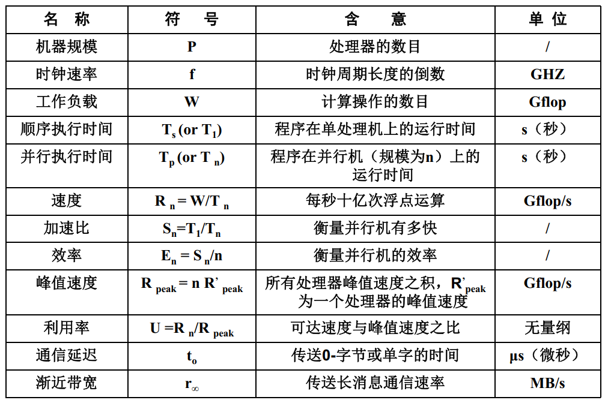
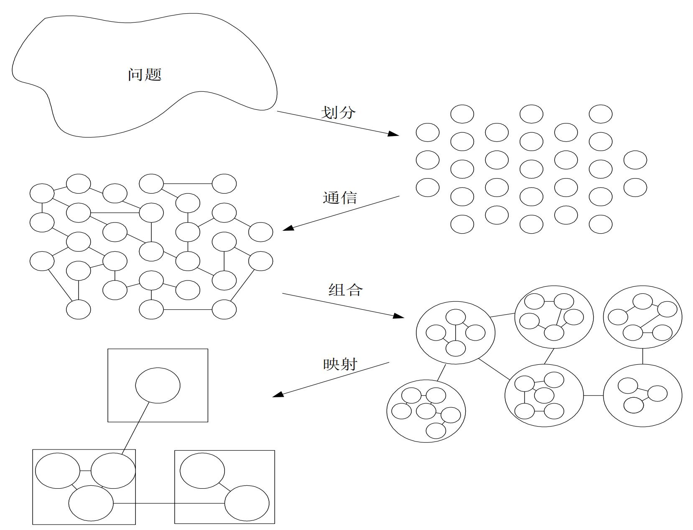

# 02 基准评测集
## 1. 计算机性能
1. 计算机性能：通常是指机器的速度，是程序执行时间的倒数
   1. 程序执行时间：指用户的响应时间，包含访问磁盘和访问存储器的时间，CPU时间，I/O时间以及操作系统的开销
   2. CPU时间：表示CPU的工作时间，不包括其他I/O等待时间等；假设机器的时钟周期为 $T_C$，程序中指令总条数为 $I_N$，执行每条指令所需的平均时钟周期数为 $CPI$，则一个程序在CPU上运行的时间 
      $$
      T_{\mathrm{CPU}} = I_N\times \mathrm{CPI} \times T_C
      $$
   3. 计算机性能评价指标
      1. MIPS(Million Instructions Per Second)：程序中指令总条数为 $I_N$，程序执行时间为 $T_E$，时钟频率为 $R_C = 1 / T_C$；但是MIPS指标忽略了不同指令系统之间的差异
      $$
      \mathrm{MIPS} = \frac{I_N}{T_E\times 10^6} = \frac{R_C}{\mathrm{CPI}\times 10^6}
      $$
      2. FLOPS（Floating-point Operations Per Second）：每秒浮点运算次数；其中 $I_{FN}$ 表示程序中的浮点运算次数
      $$
      \mathrm{MFLOPS} = \frac{I_{FN}}{T_E\times 10^6}
      $$
      
      3. 对于超级计算机：理论峰值计算性能 = CPU 时钟频率 × CPU 每个时钟周期执行的浮点运算次数 × CPU 数量
2. 机器级性能评测
   1. CPU的一些基本性能指标：工作负载如执行时间、浮点运算数、指令数目等
   2. 存储器基本性能指标：存储器带宽
   3. 机器的成本、价格与性/价比
3. 程序级性能评测：Benchmark, 包括基本测试、数学库测试和并行测试程序等
4. 算法级性能评测：分为加速比性能定律和可扩展性评测标准
### 1. Amdahl 定律
1. Amdahl 给出了 **固定负载** 下程序并行化效率提升的理论上界
2. 假设 $P$ 为并行处理器数量， $W = W_S + W_P$ 是问题规模，其中 $W_S$ 是串行分量，$W_P$ 是可并行化部分， $f = W_S / W$ 是串行分量比例， $T_s$ 是串行执行时间， $T_p$ 是并行化后的执行时间， $S$ 是加速比， $E$ 是效率；则一个并行程序的加速比 
   $$
   S = \frac{T_s}{T_p}
   $$
   如果 $S = P$ ，则称该并行程序有 **线性加速比**
   效率
   $$
   E = \frac{S}{P} = \frac{T_s}{P\cdot T_p}
   $$
   Amdahl 定律：在固定负载下，加速公式为
   $$
   \begin{align*}
   S &= \frac{W_S + W_P}{W_S + \frac{W_P}{p}}
   S &= \frac{f + (1 - f)}{f + \frac{1 - f}{p}} = \frac{p}{1 + f(p - 1)} \\
   \lim_{p\to\infty} S &= 1 / f
   \end{align*}
   $$
   可以看到加速比是 **有上限** 的
   另外，考虑并行程序产生的额外开销 $W_O$
   $$
   S = \frac{W_S + W_P}{W_S + \frac{W_P}{p} + W_O} = \frac{p}{1 + f(p - 1) + W_Op/W}
   $$
### 2. Gustafson 定律
1. 基本思想：Gustafson 认为，增加处理器必须相应的 **增大问题规模** 才有实际意义，因此 Gustafson 定律是 放大问题规模的加速公式
2. 假设 $P$ 为并行处理器数量， $W = W_S + W_P$ 是问题规模，其中 $W_S$ 是串行分量，$W_P$ 是可并行化部分， $f = W_S / W$ 是串行分量比例；则一个并行程序的加速比 
   $$
   \begin{align*}
      S^{\prime} &= \frac{W_S + pW_P}{W_S + \frac{p\cdot W_P}{p}} = \frac{W_S + pW_P}{W_S + W_P} \\
      S^{\prime} &= \frac{f + p(1 - f)}{f + \frac{p(1-f)}{p}} = f + p(1 - f) \\
      S^{\prime} &= \frac{W_S + pW_P}{W_S + W_P + W_O} = \frac{f + p(1 - f)}{1 + W_O/W} (考虑并行开销 W_O)
   \end{align*}
   $$
### 3. Sun-Ni 定律
1. 基本思想：**存储受限的加速定律**，只有存储空间许可，应尽量增大问题规模以产生更好和更精确的解
2. 假定在单节点上使用了全部存储容量 $M$ 并在相应于 $W$ 的时间内求解之，此时工作负载 $W= f W + (1-f )W$，在 $p$ 个节点的并行系统上，能够求解较大规模的问题是因为存储容量可增加到 $pM$，令因子 $G(p)$ 反映存储容量增加到 $p$倍时并行工作负载的增加量；则一个并行程序的加速比
   $$
   \begin{align*}
   S^{\prime\prime} &= \frac{fW + (1-f)G(p)W}{fW+(1-f)G(p)W/p} = \frac{f+(1-f)G(p)}{f + (1-f)G(p)/p} \\
   S^{\prime\prime} &= \frac{fW + (1-f)G(p)W}{fW+(1-f)G(p)W/p+W_O} = \frac{f + (1-f)G(p)}{f + (1-f)G(p)/p+W_O/W}
   \end{align*}
   $$
3. 可以看到当 $G(p) = 1$ 时为 Amdahl 定律，而 $G(p) = p$ 时为 Gustafson 定律；当 $G(p) > p$ 时，相应于计算机负载比存储要求增加得快，此时 Sun-Ni 加速均比 Amdahl 加速和Gustafson 加速高
### 4. 可扩展性评测标准
1. 可扩展性评测标准
   1. 并行计算的可扩展性：可扩展性最简朴的含意是在确定的应用背景下，计算机系统（或算法或程序等）性能随处理器数的增加而按比例提高的能力
   2. 影响加速比的因素：处理器数量以及问题规模，以及并行处理引起的额外开销
2. 等效率度量标准：在保持效率 $E$ 不变的前提下，研究问题规模 $W$ 如何随处理器个数 $p$ 而变化
3. 等速度度量标准：在保持平均速度不变的前提下，研究处理器个数 $p$ 增多时应该相应的增加多少工作量 $W$；并行计算的速度 $V$ 为工作量 $W$ 除以并行时间 $T$；$p$ 个处理器的并行系统的平均速度定义为并行速度 $V$ 除以处理器个数 $p$
4. 平均延迟度量标准：在保持效率 $E$ 不变的前提下，用平均延迟的比值来标志随处理器个数 $p$ 增加需要增加的工作量 $W$；假设 $T_i$ 为 $P_i$ 的执行时间，包含延迟时间 $L_i$，那么系统平均延迟时间 
   $$
   \bar{L}(W, p) = \sum_{i=1}^p\left( T_{para} - T_i + L_i \right) / p
   $$

## 2. 基准评测集
1. 基准评测集：性能基准评测就是从基准测试程序和测试规范的角度评价和预测系统的性能；基准评测集可以帮助机构确定所需采购的超级计算机；可以指导制造商高性能计算机系统的设计方向；是探索 HPC 趋势的重要历史记录
2. 基本基准测试程序
   1. [Whetstone](gallery/https://www.netlib.org/benchmark/whetstone.c)
   2. [Dhrystone](gallery/https://www.netlib.org/benchmark/dhry-c)
   3. [NPB](gallery/https://www.nas.nasa.gov/assets/nas/pdf/techreports/1994/rnr-94-007.pdf)
   4. [PARKBENCH](gallery/https://www.netlib.org/parkbench/)
   5. [STAP](gallery/https://www.mathworks.com/help/phased/ug/introduction-to-space-time-adaptive-processing.html)
3. 商用基准测试程序: [TPC](gallery/https://www.tpc.org/)
4. [SPEC](gallery/https://www.spec.org/) 测试程序
5. HPC 测试程序
   1. 计算性能评测集：[Linpack](gallery/https://www.netlib.org/linpack/)，[HPCG](gallery/https://www.hpcg-benchmark.org/)，[Graph500](gallery/https://graph500.org/)
   2. IO性能评测集：[MDTest](gallery/https://www.glennklockwood.com/benchmarks/mdtest.html)，[IOR](gallery/https://wiki.lustre.org/IOR)，[IO500](gallery/https://wiki.lustre.org/images/9/92/LUG2019-IO500_Storage_Benchmark_for_HPC-Dilger.pdf)
   3. 网络性能评测集：[IMB](gallery/https://www.pccluster.org/score_doc/score-7-beta1/IMB/IMB_ug-3.1.pdf)，[OSU Benchmark](gallery/https://mvapich.cse.ohio-state.edu/benchmarks/)
   4. 能耗评测集：[Green 500](gallery/https://www.top500.org/lists/green500/)
   5. 应用评测集：[Miniapplication](gallery/https://www.osti.gov/servlets/purl/1883522)

## 3. 并行算法的设计步骤
1. 任务划分（Partitioning）：将整个计算分解为一些小的任务，其目的是尽量开拓并行执行的机会
2. 通信（Communication）分析：分析确定诸任务执行中所需交换的数据和协调诸任务的执行，由此可检测上述任务划分的合理性
3. 任务组合（Agglomeration）：按性能要求和实现的代价来考察前两阶段的结果，必要时可将一些小的任务组合成更大的任务以提高性能或减少通信开销
4. 处理器映射（Mapping）：将每个任务分配到一个处理器上，其目的是最小化全局执行时间和通信成本以及最大化处理器的利用率  