# 04 高性能处理器的并行计算技术
## 1. 指令级并行
### 1. 指令级并行概述
1. 指令级并行的挑战
   1. 结构冒险：多条指令争用同一个功能部件
   2. 数据冒险：数据之间存在真假依赖
   3. 控制冒险：分支语句执行的不确定性
2. 数据相关分析
   1. RAW 写后读：真相关
      ``` shell
      # r1: RAW
      add r1, r2, r3
      sub r4, r1, r2
      ```
   2. WAR 读后写：名字相关，反相关
      ``` shell
      # r1: WAR
      sub r4, r1, r3
      sub r1, r2, r3
      ```
   3. WAW 写后写：名字相关，输出相关
      ``` shell
      # r1: WAW
      sub r1, r4, r3
      add r1, r2, r3
      ```
   4. 数据相关不一定会导致数据冒险
   5. 按序发射/按序回收 与 按序发射/乱序回收
      1. 按序发射/按序回收：按顺序发射指令，如果一条指令要用到前面指令的结果，需要延迟；按序回收指令，前面的指令没有回收，则当前指令也不能回收
      2. 按序发射/按序回收：按顺序发射指令，如果一条指令要用到前面指令的结果，需要延迟；乱序回收：只要执行完了就可以回收 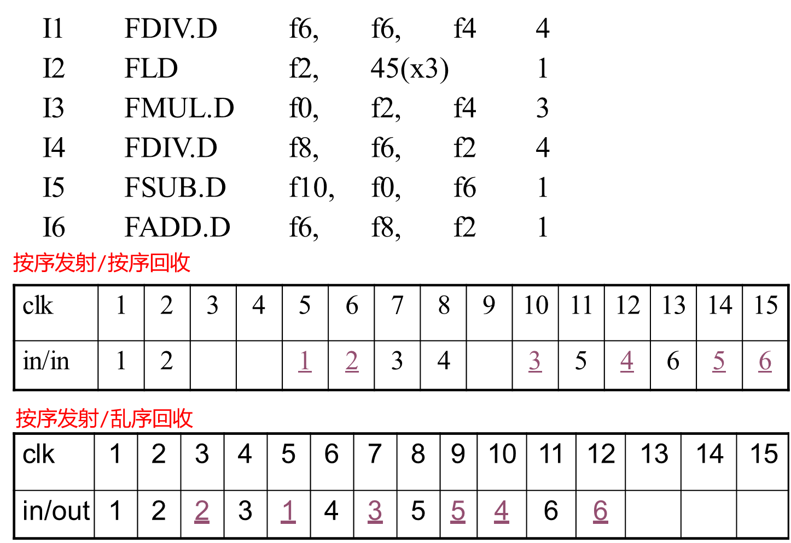
3. 数据相关的解决方法：转发：将计算出的结果尽早地发送到等待该结果的部件 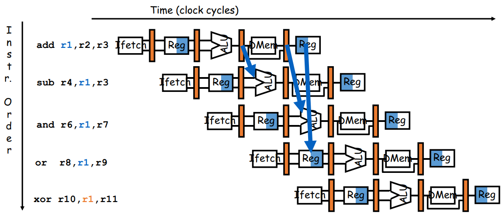但是转发不能解决所有问题


### 2. 基于循环展开的指令调度
1. 优势
   1. 降低循环条件的判断在代码中的比例：分支指令本身会带来额外的延迟以及控制冒险
   2. 提升循环体内的可发掘的指令级并行性：循环体内指令变多，充分利用功能部件，且乱序执行调度的余地更大
2. 步骤
   1. 确认循环迭代是不相关的， 从而能够展开
   2. 使用不同的寄存器， 避免名字相关
   3. 去除多余的分支与条件指令， 调整循环终止与迭代代码
   4. 分析是否存在关于存储地址的相关性
   5. 对代码进行调度
3. 缺点
   1. 代码量显著增长， 并由此可能引起频繁的指令缓存缺失
   2. 寄存器消耗较多， 并由此可能引起不必要的访存操作


### 3. 基于计分板的指令调度
1. 循环展开等静态调度的缺陷：需要对每个流水段的执行时间有明确的预期，实际上，指令的执行有很多的不确定性：例如同一种指令集体系结构具有不同的组成和实现方式，从而具有不同的微体系结构；一些相关性在编译阶段难以发现；以及一些不可控的额外延迟：如缓存缺失
2. 计分板（scoreboard）结构
   1. 记录已发射指令的状态
   2. 记录各个**寄存器**的使用和等待情况
   3. 记录各个**功能单元**的使用和等待情况 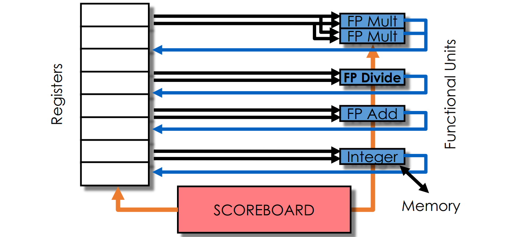
3. 动态 调度机制
   1. 针对多个功能部件和流水线展开调度
   2. 针对RAW：设置数据就绪位，强制等待数据就绪（**真相关**）
   3. 针对WAR：在一个寄存器被读之前，不允许后续的指令写
   4. 针对WAW：延迟寄存器写回，避免覆盖
4. 流水线四个阶段
   1. 发射阶段：译码，检查结构冒险
      1. 按指令原始顺序发射
      2. 有**结构冒险、WAW冒险**则不能发射
   2. 读操作数：在没有冒险时读操作数
      1. 在 RAW写后读 消除后 读操作数
      2. 计分板不考虑转发（forward）
   3. 执行：对操作数做运算：执行指令，并向计分板通知指令执行完成
   4. 写回：在没有WAR冒险时写回结果
5. 运作机制
   1. 记录指令状态：处于流水线哪一阶段（发射、读取、执行、写回）
   2. 记录寄存器的状态：记录每个寄存器是否会被某个功能单元写入；如果是，记录将会被哪个功能单元写入
   3. 记录功能单元的状态：记录各个功能单元的使用和等待情况，9字段标记
      1. busy：当前单元是否空闲
      2. op：当前单元执行的操作
      3. fi：目的寄存器编号
      4. fj、fk：源寄存器编号
      5. qj、qk：为源寄存器产生数据的功能单元
      6. rj、rk：源寄存器中数据是否就绪的标志位 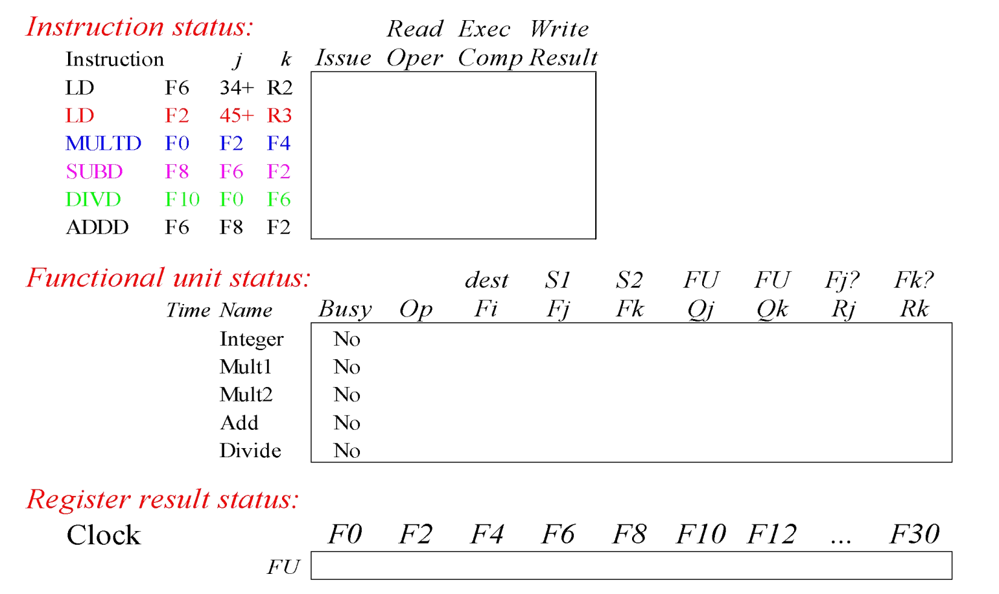
6. 例子：P68-103
7. 计分板调度的特点：按序发射、乱序执行、乱序写回
8. 计分板的不足
   1. 没有转发
   2. 没有考虑分支指令，只能处理基本块内的调度，窗口较小
   3. 发生结构冒险时，不能发射指令；实际上可以发射，因为有流水线
   4. 没有重命名
      1. 等待WAR冒险
      2. 阻止WAW冒险
   5. 写寄存器和读寄存器的数据不能同时进行，需要一个额外的时钟周期


### 4. 基于Tomasulo算法的指令调度
1. 寄存器重命名
   1. 背景：只有当指令的操作数可用时，才能执行指令，从而避免RAW冒险；WAR和WAW冒险源于名称依赖，通过寄存器重命名的方式可以消除此类名字相关
   2. 例子 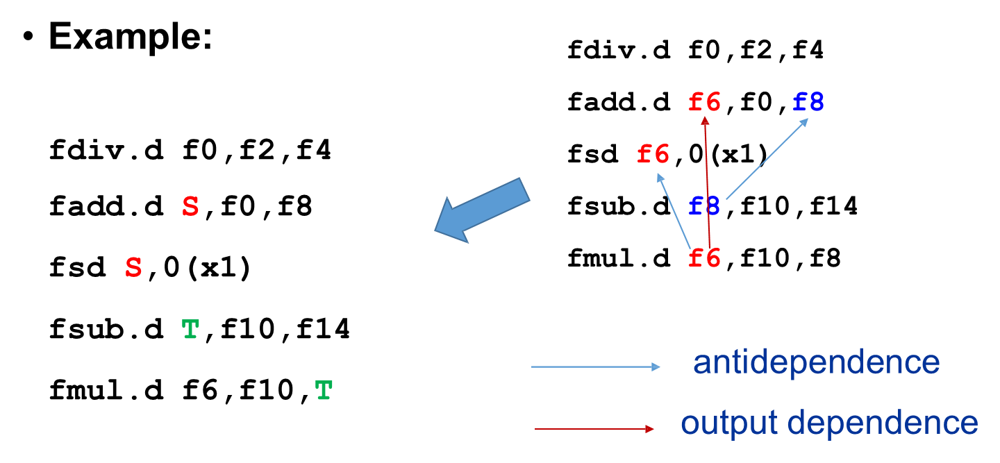 通过寄存器重命名，最终只会剩下 RAW 冒险
2. Tomasulo算法：也是一种动态算法
   1. 引入保留站（Reservation Stations，RS）：存储指令、缓冲操作数值（如果可用）、提供操作数值的指令保留站号：图中蓝色部分 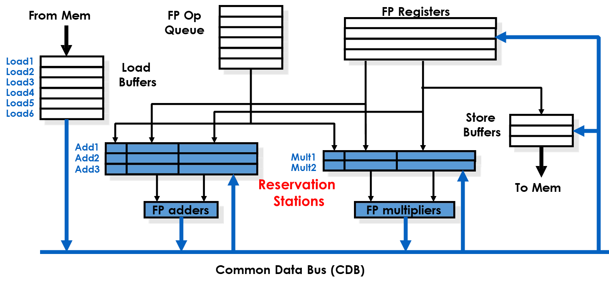保留站记录的信息：
      1. Op：操作类型
      2. Busy：是否占用
      3. Vj、Vk：源操作数的值，以及准备好的源操作数保留在此
      4. Qj、Qk：如果源操作数的值还未就绪，它依赖保留站的哪一项；0表示准备好了；即对于一个源操作数，V和Q只有一个有效
      5. A：Load、Store指令对应的地址；如果地址还未算出来，则保留立即数；如果地址已经计算，则保留访存目标地址的值
   2. Tomasulo算法
      1. RS在操作数可用的时候立即获取并缓存到RS中
      2. 计算完成的结果会送到RS中需要数据的指令处，以及通过 **公共数据总线** CDB 进行广播
      3. 只有最终的输出才会更新到寄存器中
      4. 一旦指令发射，就会产生寄存器重命名
      5. 初始化：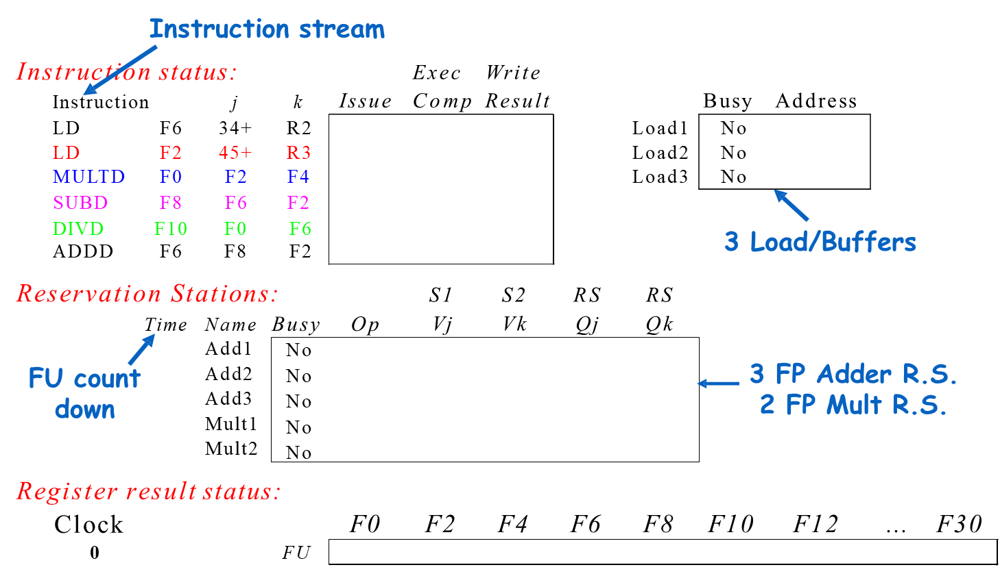
   3. 指令中的寄存器 被 数值或者指向保留站的指针 代替这一过程称为 寄存器重命名(register renaming)
      1. 消除WAR、 WAW冒险
      2. 保留站 比 实际寄存器 多， 因而可以完成优化编译器所不能完成的一些工作结果
      3. 从 RS 直接 到 FU（功能部件）， 无需通过寄存器, 而是通过公共数据总线（ Common Data Bus） 把结果广播到所有FU
      4. 载入（Load） 和 存储（Stores） 也像 其他功能部件一样使用保留站
   4. 算法步骤：
      1. 发射：从指队列的头部取下一条令，指令队列 FIFO顺序维护，以确保能够保持数据流的正确性。如果有一个匹配保留站为**空**，则将这条指令发送到这个站中，如果操作数值当前已经存在于寄存器，也一并发送到站中。如果没有空保留站，则存在结构性冒险，该指令会停顿，直到有保留站或缓冲区被释放为止。如果操作数不在寄存器中，则一直跟踪将生成这些操作数的功能单元。这一步骤将对寄存器进行重命名，消除 WAR和 WAW 冒险
      2. 执行：当操作数可用时，将其存储在等待它的任何保留站中；当所有操作数都准备好后，就可以执行操作了；如果尚未准备好，等待公共数据总线广播 以获取结果
      3. 写回：将结果放到 CDB 进行广播，到等待此结果的寄存器、保留站和存储缓冲区；真正最终存储必须等到存储地址和要存储的值可用；最后标记保留站位置可用，给下一条指令提供保留站功能单元的位置
   5. 优势
      1. 分布式的冒险检测：分布式的保留站，每个保留站可以自主判断冒险；CDB的使用使得一个结果被多个功能单元等待， 这些功能单元能同时得到该结果的广播消息
      2. 能够消除WAW、 WAR冒险：利用保留站可实现寄存器的重命名
         1. WAR： 一旦数据从寄存器读到保留站， 则不再依赖该寄存器
         2. WAW： 两条指令的目标寄存器相同， 但他们的结果由不同的功能单元等待， 仍然不会发生WAW
   6. 劣势：需要大量的硬件支持，保留站需要必须包含相关联的高速缓冲区，控制逻辑复杂；对CDB的要求也很高，表现受限于单一CDB的传输速度
   7. 适用场景：寄存器较少的体系结构；代码难以调度的场景


## 2. 分支预测与推测执行
### 1. 分支预测
1. 背景：分支指令出现频繁，调度方法都没有涉及分支指令的处理，指令级并行发掘的越多，分支带来的性能损失越大
2. 延迟分支的方法
   1. 分支执行的时间执行一些没有依赖的指令，这样无论进不进入分支都没有影响结果
   2. 缺点
      1. 需要重新定义架构
      2. 导致轻微的代码扩展
      3. 中断处理变得更加困难
      4. 需要额外的硬件来实现延迟分支
3. 分支预测的方法
   1. 静态分支预测：低成本，依赖于编译时可用的信息，认为一个分支指令的结果通常会高度偏向于采取或者不采取一方
   2. 动态分支预测：利用最近转移发生的情况，来预测下一次可能发生的转移；预测后，在实际发生时验证并调整预测
      1. 分支历史记录表 BHT：BHT 用于存储分支指令的历史信息，主要是关于这些分支指令的执行情况转移发生的历史情况记录在BHT（分支历史记录表）
      2. 分支预测缓冲器 BPB：BPB 是用于存储分支预测信息的缓冲器。它包含了关于当前执行的指令是否为分支指令以及分支方向的信息。BPB 通常与BHT相结合，通过查找BHT中的历史记录，预测当前分支指令的执行路径。如果分支预测成功，处理器可以继续执行预测的分支路径，从而提高指令执行效率。如果预测失败，可能需要回滚一些指令以恢复到正确的执行状态
      3. 分支目标缓冲器 BTB：BTB 存储了分支指令的目标地址。当分支指令成功预测并执行时，处理器可以通过查找BTB获取分支目标的地址，以便继续执行下一条指令；包含分支预测，要给出转移目标的地址甚至转移目标的指令
   3. 每个表项由分支指令地址低位作索引， 故在IF阶段就可以取到预测位
      1. 低位地址相同的分支指令共享一个表项， 可能存在冲突
      2. 由于仅用于预测， 所以不影响执行结果
   4. 简单的一位预测器：记录分支指令最近一次的历史，BHT中只需要一位二进制位；只要发生预测错误就改变
      ```mermaid
      graph LR
      Y([Predict Taken 1]) -->|not taken| N([Predict Not Taken 0])
      Y -->|taken| Y
      N -->|not taken| N
      N -->|taken| Y 
      ``` 
   5. 简单的2位预测器：记录分支指令最近2次的历史，只有连续两次预测错误才改变 
   6. 相关预测器（两级预测器）：相关预测器是看**最近所有分支指令**的历史；对于(m, n) 相关预测器，用移位寄存器记录最近m个分支的转移情况，转移成功置为1，否则置为0；之后根据这m位去寻址 $2^m$ 个预测器，每个预测器n位；
   7. 局部预测器：为**每个分支**设置 $2^n$ 个2位的预测器；根据最近本身发生的n次分支从$2^n$个2位的预测器中选出一个
   8. tournament竞赛预测器：将相关预测器与局部预测器相结合；全局预测器使用最新的分支历史记录来索引预测器；局部预测器使用分支的地址作为索引 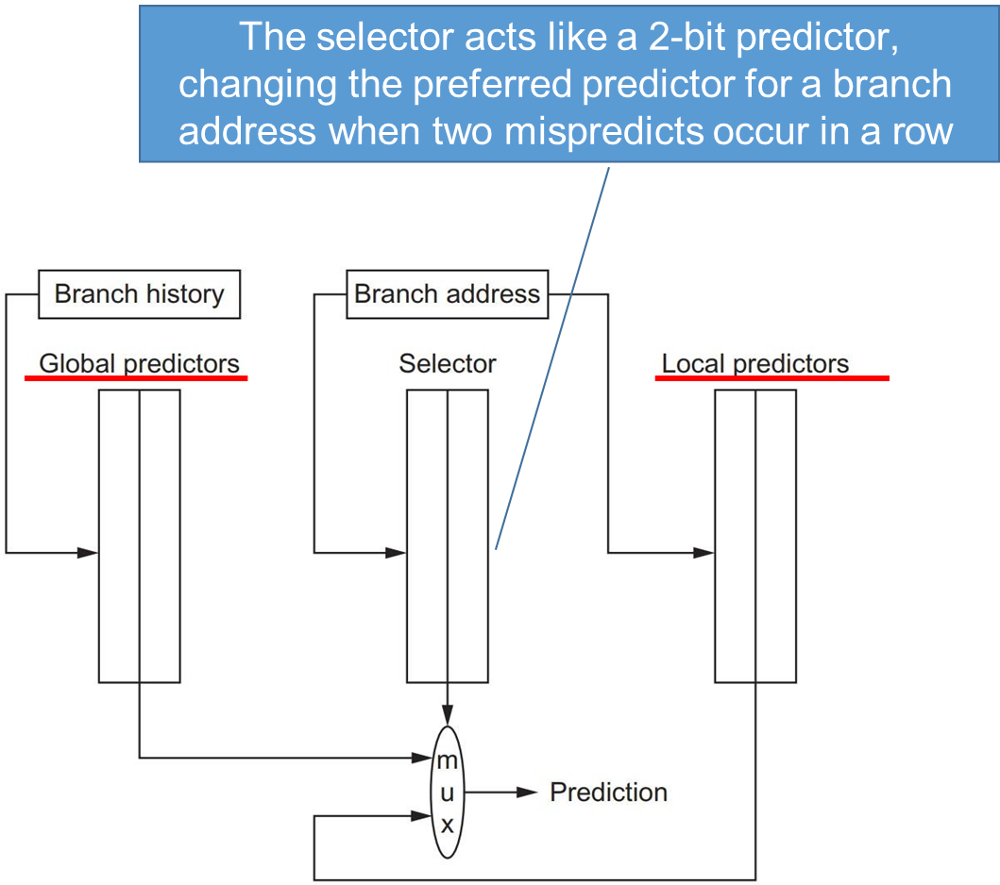采用一个饱和计数器（如2位计数器），在两者之间选择
      1. 计数器值为00、01，选择局部预测器
      2. 计数器值为10、11，选择相关预测器


### 2. 推测执行
1. 推测执行的挑战
   1. 分支预测错误：可以按照分支预测执行，但是必须保证分支结果确定后再提交
   2. 精确中断：一条指令发生中断、异常，其后的指令不能已经提交
   3. 计分板和Tomasulo算法都不是按序提交
2. 基本理念
   1. 假定分支预测永远正确，按预测结果发射指令
   2. 对发射的指令动态调度
   3. 设计一定的机制容忍预测错误
3. 引入重排序缓存 ROB
   1. 将发射指令按序保存在ROB中，记录指令的目的寄存器和PC值
   2. 将指令执行结果保存在ROB中，但是可以广播到保留站各个等待该结果的单元；记录可能发生的中断、异常
4. 优化：重排序缓存 + forwarding + 推测执行
   1. forwarding：将已经确定提交的结果直接Forward到需要该结果的指令 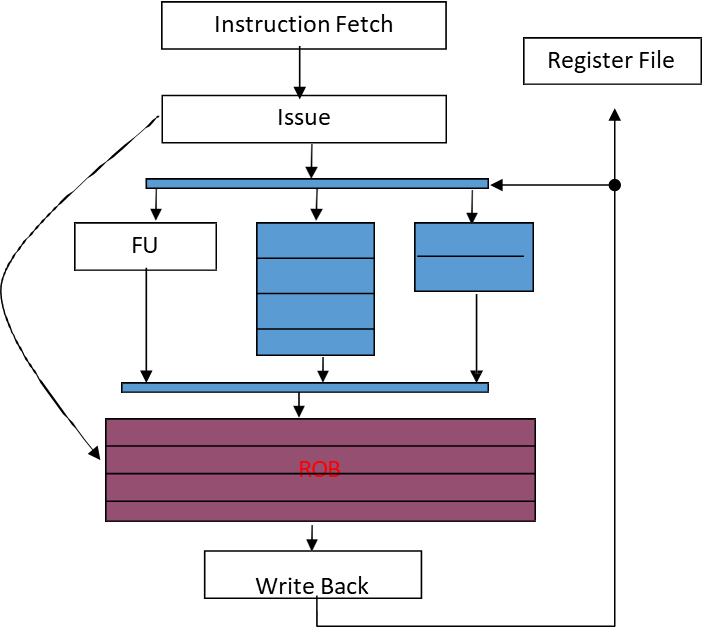
   2. 推测执行：发射分支指令到ROB，但须标记这是猜测执行的指令；正常执行分支指令，但谨慎提交；分支确定之后决定是否提交：预测正确，后续指令都可提交；预测错误，清除ROB中的后续指令 ；核心思想是：按序发射、乱序执行、按序提交、提前阻止一切不可逆的事件，如中断异常
5. 重排序缓存的各个字段
   1. 指令类型
   2. 目标域：寄存器编号，内存地址
   3. value
   4. ready：指令已经执行，随时准备提交 
6. 步骤
   1. 发射：分配RS和ROB，读取可用操作数
   2. 执行：当操作数值可用时开始执行
   3. 写回：将结果和ROB标签写入CDB
   4. 提交：当ROB到达ROB头部时，更新寄存器；当错误预测的分支到达 ROB 的头部时，丢弃所有条目
7. 推测执行与动态调度对比
   1. 推测执行：按序提交，维持精准的中断和精确的异常
   2. 动态调度：乱序提交，如果顺序靠前的指令发生中断或异常，难以逆转已经提交的结果


## 3. 多发射技术与指令级并行的限制
### 1. 多发射技术
1. 超标量：每个时钟尝试发射多条指令；发射指令时检测所有的冒险，检测正在发射的多条指令之间的冒险，检测正在发射的多条指令与正在流水线中执行指令之间的冒险；要求数据通路中大量的冗余部件
   1. 复杂度：假定每个时钟发射W条指令，流水线中L组指令在执行；需要与 $W*L$ 条指令做检测；硬件的复杂度为 $O(W*W*L)$
   2. 超标量挑战：指令发射的复杂度显著提高；增加发射单元的逻辑量；需要大量转发 forward，以保证RAW相关能尽快得到结果；浮点运算的瓶颈
2. 超长指令字（VLIW）：编译器将多条不相关的指令打包成一个“指令包”
   1. 依赖编译器发现指令级并行，硬件不负责检测指令之间的冒险，硬件设计简单
   2. 将多条不相关的指令打包成一个指令包，里面每条指令占用一个独立的功能单元
   3. 每个指令包用一条 “超长” 的指令表示： 112到168位；如果找不到合适的操作，则填充NOP
   4. 缺陷
      1. 代码容量显著增长：特别依赖循环展开，大量功能单元需要用NOP填充
      2. lock-step限制：一个发射包里面的指令要一起执行完毕，执行时间以最长的指令为准；任何功能单元（FU） 的停顿导致整个处理器停顿，访存操作最容易导致停顿， 且无法预测
      3. 代码的可移植性
         1. 在新的硬件下需要重新编译源代码
         2. 代码取决于：指令集，流水线结构，各个功能单元的延迟
         3. 不同的流水线结构和功能单元延迟需要不同的代码

### 2. 多线程技术
1. 线程级并行TLP：软件方法，一个程序划分为多个线程，更粗粒度的并行，主要用于含有多线程程序的执行速度
2. 技术分类
   1. 细粒度的多线程：每个始终发生一次线程切换，多个线程交替执行
      1. 优点：功能单元的利用率高
      2. 缺点：单个线程的执行时间变长
   2. 粗粒度的多线程：当一个线程发生成本较高的流水线停顿时，发生切换
      1. 优点：单个线程的执行时间不会显著增长
      2. 缺点：功能单元的利用率不高：一个线程发生代价不大的停顿时，不会发生切换，存在气泡；线程切换时，流水线启动时存在气泡
   3. 同时多线程SMT
      1. 设置大量的虚拟寄存器，每个线程都有一组寄存器
      2. 通过寄存器重命名和动态调度实现细粒度的多线程，不同线程的指令之间没有相关性
      3. 往往与超标量、动态调度等技术联合使用 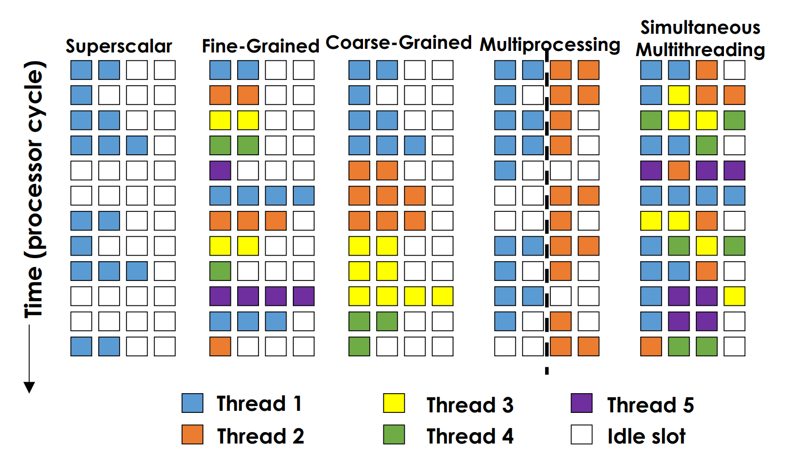
      4. SMT的问题
         1. 单线程性能和总体吞吐率不能两全：SMT提升总体吞吐率（功能单元利用率），但会降低单线程的性能；也可以给某个特定的线程更高的调度优先级
         2. 需要大量的寄存器组文件来保存多个线程的上下文
         3. 有可能增加时钟周期的长度，降低主频：发射单元复杂：需考虑多个线程的指令流；指令提交复杂：选择哪条指令提交
         4. 多线程之间的Cache和TLB的争用有可能降低性能


## 4. 数据级并行
### 1. Introduction
1. Flynn 分类法
   1. SISD：单指令流、单数据流
   2. SIMD：单指令流、多数据流：向量体系、GPU等
   3. MISD：多指令流、单数据流：目前没有对应的体系结构
   4. MIMD：多指令流、多数据流
2. SIMD
   1. SIMD 架构可以利用重要的数据级并行性来实现：
      1. 面向矩阵的科学计算
      2. 面向多媒体的图像和声音处理器
   2. SIMD 允许程序员顺序思考

### 2. Vector Architecture
1. 基本思想：将一组数据元素读入“向量寄存器”，对这些寄存器进行操作，将结果分散回内存；其中寄存器由编译器控制，用于隐藏内存延迟，高效利用内存带宽
2. RV64V: 结构 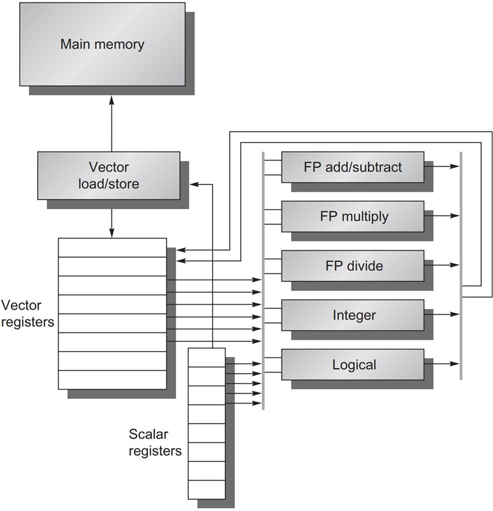 
3. 向量结构的执行时间因素
   1. 所操作的向量长度
   2. 操作之间的结构冒险
   3. 数据依赖
4. 护航指令组convoy
   1. 将可能一起执行的向量指令放在一个convoy里；convoy内的指令不得包含任何结构性危险；如果存在此类危险，则需要在不同的convoy中
   2. 在一个convoy中允许有具有写后读依赖危险的指令集合；通过chaining机制，允许向量运算操作在其 源操作数的独立元素 可用时 立即开始 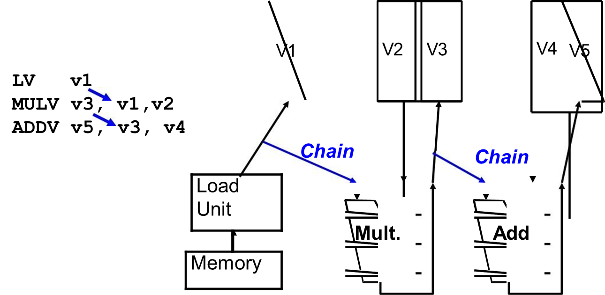chaining的好处：当结果出现后可以快速开启下一个操作，提高了效率
5. 钟鸣chimes: 执行一个护航指令组的时间单位：假设有m个护航指令组，一个向量长度为n，那么执行时间为 $m \times n$ 个时钟周期（向量处理器每个时钟周期执行一个向量的一个元素）
6. 向量处理器的改进
   1. 多车道技术：使用多个功能单元执行同一向量指令 
   2. 向量长度寄存器
      1. 在实际编程的时候，特定向量的长度在编译阶段可能是未知的，解决方法是增加一个向量长度寄存器，用于控制向量的长度
      2. strip mining：假设向量处理器可以一次处理的最大向量长度为 `mvl`，那么如果向量的长度 `n` 大于 `mvl` 的时候，我们需要进行长度的切分 其中 `m` = `n % mvl`，即切分为：最开始的长度是余数长度的向量，后面的都是 `mvl` 长度的向量
   3. 向量遮罩（mask）寄存器：主要用于应对循环中的 `if` 语句
      ```c
      for (i = 0; i < 64; i++) {
         if (x[i] != 0) {
            x[i] = x[i] - y[i]; 
         }
      }
      ```
      1. 遮罩寄存器会维护一个 mask（即一个布尔向量），当mask被设置好时，所有后续向量指令仅对寄存器中的条目为 1 的向量元素进行操作 
   4. memory banks：向量的存储读出需要高带宽，因此可以将memory划分为多个memory banks，以供单独处理和控制memory
      1. bank busy time：连续访问同一bank之间的最短时间间隔
      2. memory bank conflict：当对于同一个bank的访问速度快于bank busy time时，就会发生冲突停顿 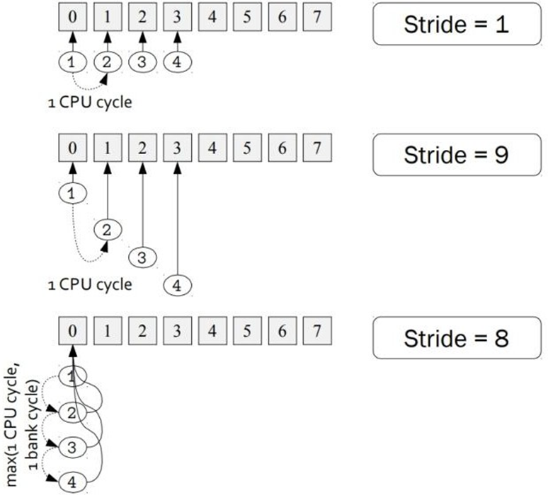
   5. 步长stride: 获取到同一单个向量寄存器时元素之间的距离；例如
      ```c
      for (i = 0; i < 100; i++) {
         for (j = 0; j < 100; j++) {
            for (k = 0; k < 100; k++) {
               /*
                假设bc是按行存储
                那么对于 b，访问元素的stride = 1
                但是对于 c，访问元素的stride = 100
                */
               a[i][j] += b[i][k] * c[k][j]
            }
         }
      }
      ```
      1. 访问非顺序内存位置并将其重塑为密集结构的能力是向量体系结构的主要优势之一
      2. 选取到不合适的stride可能会导致频繁访问同一memory bank，从而导致memory bank conflict
   6. 处理稀疏矩阵等类似的稀疏的数据结构：在稀疏矩阵中，大部分元素为0，即不需要参与计算的
      1. index vectors: 告知矩阵的哪些位置是有元素的，可以维护一个索引向量 `k` `m`
         ```c
         // suppose that a and c: sparse matrix
         for (i = 0; i < n; i++) {
            a[k[i]] += c[m[i]]; 
         }
         ```
      2. gather-scatter 
         1. gather: 通过index vector来获取稀疏矩阵上的非零元素，之后以稠密形式进行操作运算
         2. scatter: 在以稠密形式对这些元素进行操作后，可以使用相同的index vector通过分散存储以扩展形式存储到稀疏矩阵

### 3. SIMD Instruction Set Extensions for Multimedia
1. SIMD Extension：许多媒体应用程序运行的数据类型比 32 位字长更窄；例如图形：8位彩色；音频样本：8-16 位；通过划分 256 位加法器内的进位链，处理器可以对短向量执行同时操作
2. 相较于向量体系结构
   1. 修复编码为操作码的数据操作数的数量；导致添加了数百条指令
   2. 没有复杂的寻址模式
   3. 无掩码寄存器
3. roofline performance model
   1. 计算强度arithmetic intensity: 访问内存的每个字节的浮点运算比率 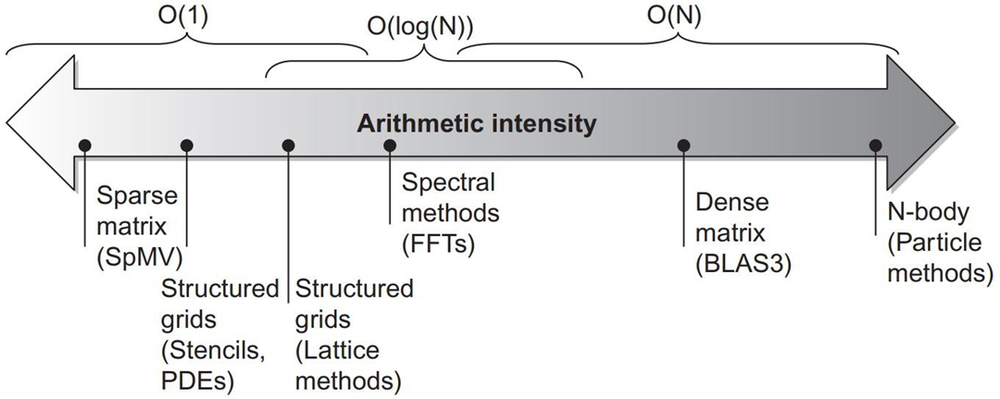 
   2. roofline model: 将浮点计算的表现和内存吞吐放在一起，其中Y轴是浮点计算性能的表现 = `min(Peak Memory Bandwidth * 计算强度, 峰值浮点计算性能)`，X轴式计算强度 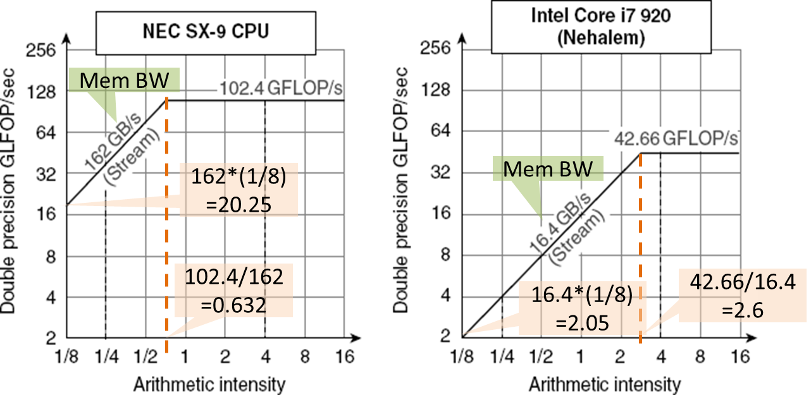

### 4. Graphics Processing Units 
1. GPU与向量体系结构
   1. 相似点
      1. 都是数据级并行
      2. scatter-gather
      3. 遮罩寄存器
      4. 大型寄存器文件
   2. 不同点
      1. 没有标量寄存器
      2. 利用multithread来掩盖存储延迟的问题
      3. 具有大量的功能单元不见
2. threads, blocks, grid
   1. thread：一个线程与每个数据元素相关联（注意不同于操作系统的thread的定义）threads组织成为blocks，blocks组织成为grid 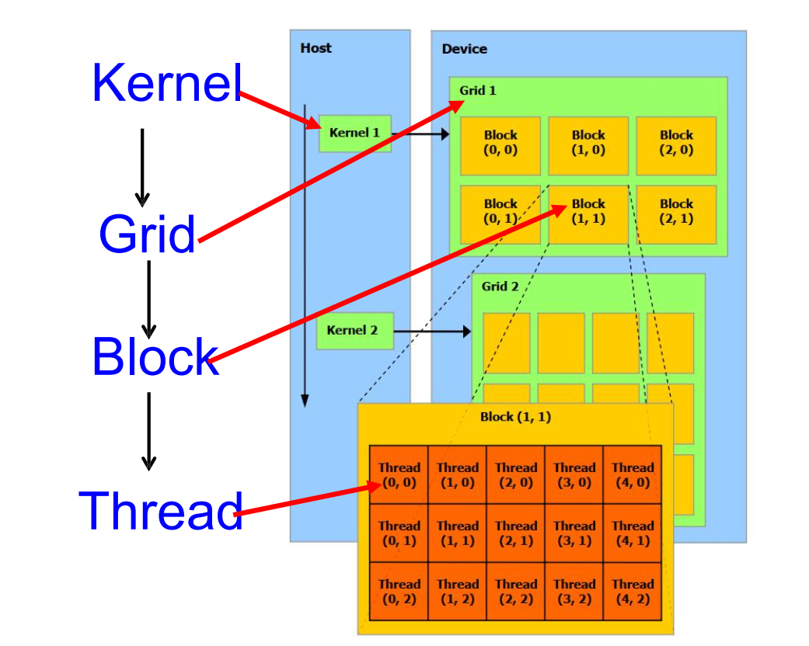
   2. grid: 一个grid为一组block
   3. block：一个block被分配到一个SIMD处理器上
   4. warp：32个线程组成一个warp，在单个SIMD处理器上调度至多32个warp，每个warp有自己的PC，根据定义，warp之间没有数据依赖，从而实现流水线来隐藏memory latency
3. GPU 组成 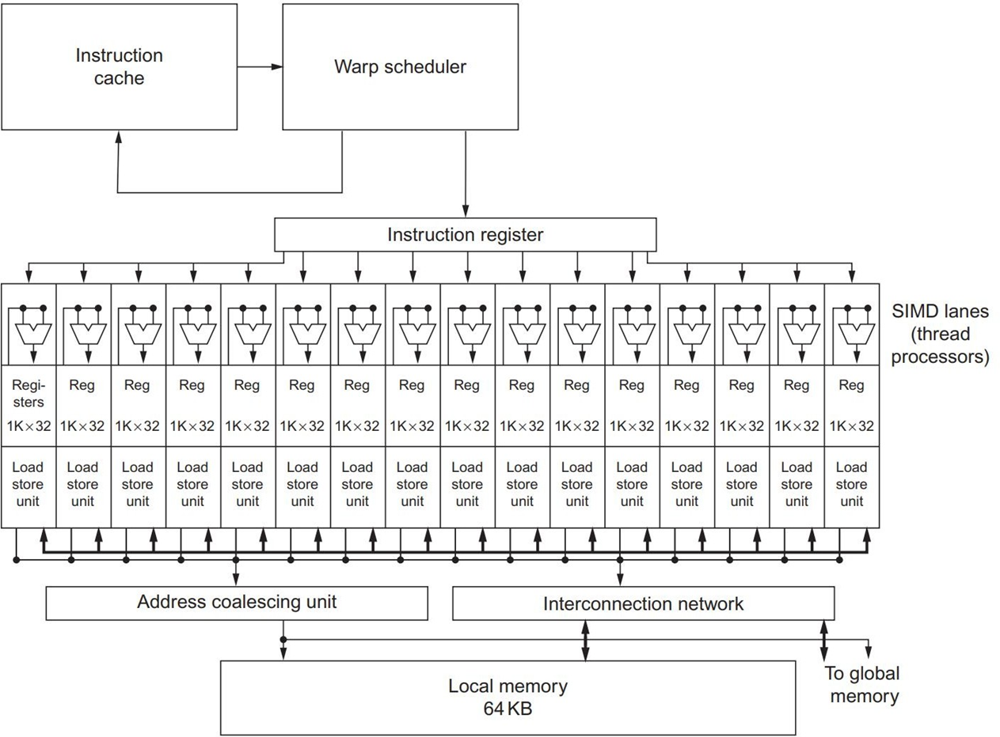
4. GPU memory结构
   1. private memory：每个SIMD车道拥有私有的off-chip DRAM，不互相共享
   2. local memory(shared memory)：每个SIMD处理器有local memory，在一个block内多个车道或者线程内共享，与其他SIMD处理器不共享
   3. GPU memory(global memory)：全局memory，可以全局共享，host也可以读取和写GPU memory 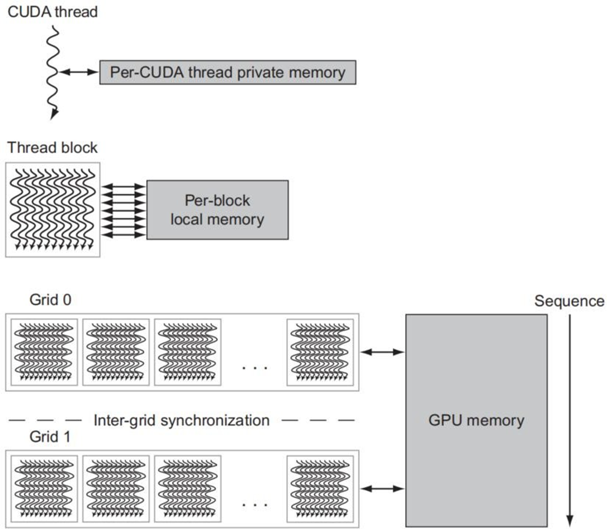

### 5. Detecting & Enhancing Loop-Level Parallelism
1. 循环间依赖
   1. 没有循环间依赖
   ```c
   for (int i = 0; i < 1000; i++)
      x[i] = x[i] + s;  
   ```
   2. 循环间依赖：可以看到 `a, b` 数组都需要用到上一个循环的数据，因此存在循环间依赖
   ```c
   for (int i = 0; i < 1000; i++) {
      a[i + 1] = a[i] + c[i]; 
      b[i + 1] = b[i] + a[i + 1];
   }
   ```
   3. 将循环间依赖转换为循环内依赖
   ```c
   for (int i = 0; i < 100; i++) {
      a[i] = a[i] + b[i]; 
      b[i + 1] = c[i] + d[i]; 
   }

   /* transform to:  */

   a[0] = a[0] + b[0];
   for (int i = 0; i < 99; i++) {
      b[i + 1] = c[i] + d[i]; 
      a[i + 1] = a[i + 1] + b[i + 1]; 
   }
   b[100] = c[99] + d[99]; 
   ```
2. 寻找依赖相关
   1. 假设 store `a * i + b`, 然后 load from `c * i + d`
   2. 如果循环间依赖存在，那么 `gcd(a, c)` 必须整除 `(d - b)`
      ```c
      for (i = 0; i < 100; i++) {
         x[2 * i + 3] = x[2 * i] * 5; 
      }

      // a = 2, b = 3, c = 2, d = 0
      // gcd(a, c) = 2, d - b = -3
      // 2 cannot divide -3, no dependence is possible
      ```
   3. 循环间依赖最重要的形式之一是递归，可以采用reduction解决
      ```c
      for (i = 0; i < 100; i++) {
         sum = sum + x[i] * y[i]; 
      }

      /* transform to: */
      for (i = 0; i < 100; i++) {
         sum[i] = x[i] * y[i];      // no dependence
      }
      for (i = 0; i < 100; i++) {
         finalsum = finalsum + sum[i]; 
      }
      ```