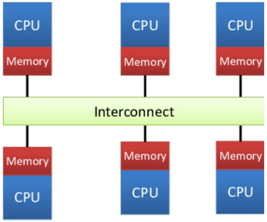
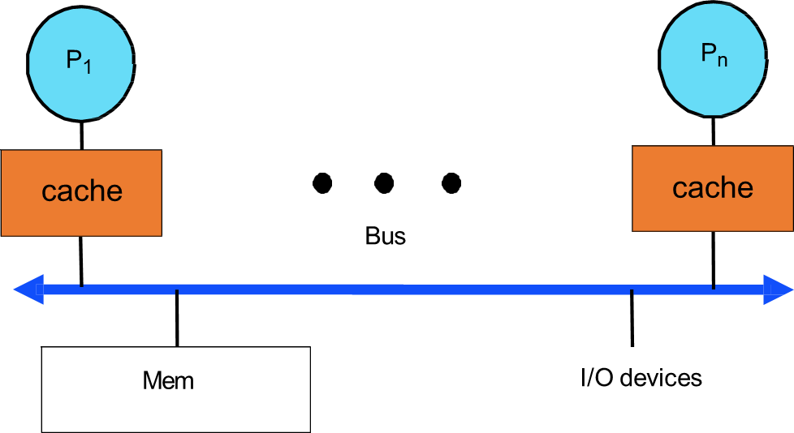
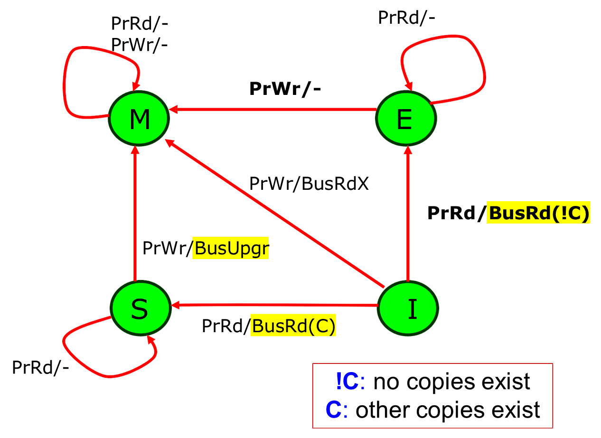

# 05 高性能计算机的存储层次
1. MIMD 细化分类
   1. 共享式内存 shared memory
   2. 分布式内存 distributed memory
2. 共享式内存：就是处理器之间共享内存，通过共享内存进行通信，所有处理器通过软件或者硬件的方式连接到一个全局可用的存储器 
3. 分布式内存：消息驱动，处理器质检部共享内存，通过消息驱动来通信，对于要共享的数据，它必须作为消息从一个处理器传递到另一个处理器 
4. 共享式内存系统
   1. 共享式内存系统
      1. 集中共享内存系统（CSM）：又叫对称多处理器系统（SMP），一致存储访问系统（UMA）
      2. 分布式共享内存系统（DSM）：又叫非一致存储器访问系统（NUMA）
      3. 在这两种体系结构中，线程之间的通信都是通过共享内存地址来完成的，所谓“共享内存”指的就是将所有的存储器抽象成一个整体存储地址
   2. 集中共享式内存
      1. 此类多处理器中处理器数目较少，所以处理器之间能够共享一个集中式的存储器；所有的存储器能够平等的访问它，这就是对称一词的由来；又因为每个处理器都能平等地访问存储器，所以它们访问存储器的延迟都是相同的，因此又被叫做一致存储访问系统
      2. 特点：有一个存储器被所有处理器均匀共享，访问共享存储器的延迟一致，每个处理器可以拥有私有内存或者高速缓存 
   3. 分布式共享内存
      1. 每个处理器都拥有自己的存储器，也可以访问其他节点的存储器；这类系统之所以叫做非一致存储访问系统，是因为每个结点访问本地内存和访问其它结点的远程内存的延迟是不同的
      2. 特点：所有的处理器都能访问一个单一的地址空间；使用LOAD和STORE指令访问远程内存；访问远程内存比访问本地内存延迟要高；每个处理器可以使用高速缓存 
         1. 不带缓存：NC-NUMA 
         2. 带缓存：CC-NUMA 
   4. 共享存储并行处理系统
      1. 包含具有统一地址空间的共享存储器
      2. 各个处理机通过共享变量进行通信与同步
5. 可扩展性共享内存系统
   | protocol | bus-based interconnection | point-to-point interconnection |
   |:--------:|:-------------------------:|:------------------------------:|
   |  snoopy  |   least scalable          | more scalable                  |
   |directory |   /                       | most scalable                  |

## 1. 集中式共享存储
### 1. 集中式共享存储并行处理系统
1. 所有的通信和本地计算都将产生对存储器的读写；共享存储成为严重的性能瓶颈；Cache是扩展存储器的一种有效方式，其主要根据访存的局部性原理
2. 缓存Cache：处理器读Cache有两种方法
   1. read through：即直接从内存中读取数据
   2. read allocate：先把数据读取到cache，然后再从cache读数据
3. cache hit
   1. write-through直写模式：在数据更新的时候，把数据同时写cache和内存，优点是操作简单，缺点是慢
   2. write-back回写模式：在数据更新时只写入缓存Cache，只在数据被替换出缓存时，被修改的缓存数据才会被写到内存；优点是数据写入速度快，因为不需要写内存；缺点是一旦更新后的数据未被写入后端存储时出现系统掉电的情况，数据将无法找回
4. cache miss
   1. write-allocate写分配模式：把要写的地址所在的块先从内存调入cache中，然后写cache
   2. write no-allocate：把要写的数据直接写到内存  
5. 依据Cache的共享方式
   1. 共享高速缓存：访问速度稍慢，但是失效率低
   2. 私有高速缓存：访问较快，但是失效率高  

### 2. 对称多处理器 SMP
1. 基于总线的对称式共享存储：若干处理器通过共享总线或交叉开关等统一访问共享存储器的结构，各个处理器具有相同的访存性能；但是基于总线的SMP可扩展性不是很好，总线带宽受限 
2. 缓存一致性协议
   1. 写传播：写入一个缓存的值必须传播到其他缓存
   2. 写入序列化：所有缓存必须以相同的顺序看到连续写入同一数据的值
   3. 需要一个协议来确保这两个属性，称为缓存一致性协议
   4. 缓存一致性协议包含
      1. snooping：每个核心跟踪每个块的共享状态
      2. directory：保存在一个位置的每个块的共享状态

### 3. snooping-based coherence protocol
1. 基本原理
   1. 处理器端：向每个节点添加一个监听器以监听所有总线事务；缓存（通过缓存控制器）通过更改缓存行状态做出反应
   2. memory端：内存控制器 (Memory Controller，MC) 还监听总线事务；MC 的反应是决定是否从内存中读取行并返回它
2. write-through 一致性协议
   1. processor行为：`PrRd`要求读, `PrWr`要求写
   2. bus行为：`BusRd`探测到有processor要求读, `BusWr` 探测到有processor要求写
   3. cache状态
      1. V(Valid): cache块有效且干净
      2. I(Invalid): cache块无效
      3. 没有脏（dirty）状态 
   4. 问题：高带宽要求，每次写都会导致写传播
3. MSI 一致性协议
   1. 3 状态
      1. I(Invalid)
      2. S(Shared): 一份或多份副本，并且内存副本是最新的；缓存块有效，可能被多个处理器共享
      3. M(Modified): 只有一份副本，值很可能与内存不同
   2. modified和dirty的区别
      1. dirty：cache的值和内存不同
      2. modified：cache的值和内存不同，但是cache的值只在一个位置
   3. processor行为：`PrRd`要求读, `PrWr`要求写
   4. bus行为
      1. `BusRd`：监听请求，表明存在另一个处理器对缓存块发出的读取请求
      2. `BusRdX`：监听请求，指示另一个处理器（而不是 `BusWr`）对缓存块发出读独占（写入）请求
      3. `Flush`：监听请求，表明整个缓存块被另一个处理器写回到主存
   5. processor initiated transactions: 
   6. bus initiated transactions: 注意`M -> I`我们进行flush，原因：已修改的字节不一定是另一个处理器想要覆盖的相同字节；另一个处理器可能想要写入其他字节，但从已修改的字节中读取 
4. MESI 一致性协议：增加了一种独占的状态
   1. 4 状态
      1. Modified(dirty) 
      2. **Exclusive**(只有一个cache拥有干净的副本，且与memory值相同) 
      3. Shared(2个及以上的caches有这个副本) 
      4. Invalid
   2. 为了判断在其他cache中是否有存在副本，增加一条 c bus line
      1. high value: 当至少有一个cache拥有副本
      2. low value: 没有cache副本
   3. bus行为
      1. `BusRd`: 监听请求，表明存在另一个处理器对缓存块发出的读取请求
      2. `BusRdX`: 监听请求，表明另一个**不具有该块**的处理器对缓存块发出读独占（写入）请求
      3. **`BusUpgr`**: 监听请求，表明存在对另一个处理器**已在**其高速缓存中的高速缓存块的写入请求
      4. `Flush`: 监听请求，表明整个缓存块被另一个处理器写回 **memory** （mandatory，写传播）
      5. **`FlushOpt`**: 监听请求，表明整个缓存块已发布到总线上，以便将其提供给**另一个处理器** （optional，作为性能增强功能实现，可以删除该功能而不影响正确性；基于从其他缓存获取数据比从内存获取数据更快的前提；也称为“缓存到缓存的传输”）
   4. processor initiated transactions 
   5. bus initiated transactions(notes: FlushOpt: cache-to-cache transfer) 
   7. clean sharing & dirty sharing
      1. clean sharing：cache分享的时候，对应块要是clean的，即与memory一致
      2. dirty sharing：cache分享的时候，对应块与memory的值不相同
   8. MESI 的问题
      1. no dirty sharing: 分享块必须是clean的
      2. 太多flush，需要高速的bus line
5. MOESI 一致性协议
   1. 5 states：多了O状态，即 owner，即拥有最新的脏数据块的cache进行分享
      1. Modified (M): 缓存块仅在一个缓存中有效，并且该值（可能）与主内存中的值不同
      2. Exclusive (E): 该缓存块有效、干净且仅驻留在一个缓存中
      3. Owned (O): 缓存块是有效的，可能是脏的，并且可能驻留在多个缓存中。 只有一个缓存处于 Owned 状态，其他缓存处于 Shared 状态。
      4. Shared (S): 缓存块有效，可能脏，并且可能驻留在多个缓存中
      5. Invalid (I)
   2. processor initiated transactions 
   3. bus initiated transactions 
   4. 关键点：
      1. 当 dirty 块被共享时，其中一个cache要充当owner的角色
      2. 当owner要替换块出cache的时候，必须写回memory
6. Dragon一致性协议
   1. 4 状态
      1. E: exclusive-clean, 我和memory都有
      2. Sc: shared-clean, 我，其他cache，（可能）memory有，但是我不是owner
      3. Sm: shared-modified, 我，其他cache有，但是memory没有，且我是owner
      4. M: modified or dirty, 只有我有
   2. **没有 Invalid** 状态
   3. processor events: `PrRd`, `PrWr`, `PrRdMiss`, `PrWrMiss`
   4. bus events: `BusRd`, `BusUpd`: 更新其他相关cache
   5. processor initiated transactions: 
   6. bus initiated transactions:  注意Dragon允许dirty sharing 

### 4. SMP 性能表现
1. 缓存一致性
   1. true sharing misses
      1. 处理器对共享高速缓存块的第一次写入会导致建立该块的所有权无效
      2. 当另一个处理器尝试读取该高速缓存块中的修改字时，会发生未命中并传输结果块 
   2. false sharing misses：当由于块中的某些字（除了正在读取的字）被写入而导致块无效时，就会发生这种情况 


## 2. 分布式共享存储
### 1. directory-based protocols
1. 目录：主内存通过目录（directory）来追踪哪些cache拥有块的副本
2. 目录的存储
   1. 中心化目录：使用一个中心化的目录来追踪所有cache上的块（包括哪些cache有该块，以及dirty状态），但是扩展性不好
   2. 分布式目录：每个处理器都有一个目录，只存储所属节点的数据块信息 
3. 基本的目录请求处理
   1. read miss：当出现读缺失的时候，发送read miss信息到主目录，之后检查哪个拥有要读取的信息
      1. 如果主目录的dirty bit是0，那么直接返回数据 
      2. 如果主目录的dirty bit是1，那么还要找到另外那个拥有最新数据的处理器；主目录返回拥有者信息给源，源再发送请求信息给拥有者，拥有者返回数据，同时返回给主目录以更新块信息为clean 
   2. write miss：当出现写缺失的时候，主目录返回所有共享者的信息以及数据，然后源发送要进行写修改的信息，以无效化其他共享者，其他共享者收到信息后回复ack，之后源**才进行写修改** 

### 2. 分布式共享存储目录组织 DSM Directory Organization
1. 目录协议：每个处理器核上存在一个目录，记录所负责的内存地址的共享状态，目录之间通过拓扑网络连接而不是集中总线 
2. 目录：每一存储块都有一个目录状态，是一个向量，包括哪些 cache 含有该存储块，是否 dirty；目录表的大小正比于存储块数和节点数的乘积，这样的话目录过于庞大，为了防止目录成为系统瓶颈，可采用分布式目录表
3. 全映射目录
   1. 存放与全局存储器中每个块有关的数据：目录项中有P个处理器位和一个脏位 
   2. 优点：效率高
   3. 缺点：过多的存储器开销，可扩展性差
4. 有限目录
   1. 不管系统规模多大，每个目录项均含有固定数目的指针：假设 有 `i` 个指针，如果多于 `i` 个cache请求读，会导致 **驱逐** 
   2. 驱逐eviction：当Cache1和Cache2中都有X的拷贝时，若P3请求访问X，则必须在在Cache1和Cache2中选择一个使之无效，这种替换过程称为驱逐 
5. 链式目录
   1. 将目录分布到各个高速缓存，通过维护一个目录指针链来跟踪共享数据拷贝；当某一处理机需要写X时，它必须沿整个目录链发送一个数据无效信息。在收到所有处理机的回答信号之后，存储器才给该处理机写允许权 
   2. 当Cache中的数据块需要替换时，要把该Cache从目录链中删除：三种方法
      1. 把Cache i+1的指针指向Cache i-1。在Cache i中存放新数据块
      2. 使Cache i及在链中位于其后的所有Cache中的单元X无效
      3. 使用双向链。在替换时不再需要遍历整个链。但指针增加了一倍，一致性协议也更加复杂
   3. 优点：不限制共享数据块的拷贝数目，又保持了可扩展性；指针的长度以处理机数目的对数关系增长， Cache的每个数据块的指针数目与处理机数目无关
   4. 缺点：链式目录的复杂程度超过了前两种目录

### 3. 基础DSM Cache一致性协议
1. MESI in DSM: 目录 3 状态
   1. shared(S): 该块被干净地缓存，可能由多个缓存共享
   2. uncached(U): 该块没有缓存或者缓存invalid状态
   3. Exclusive or Modified(EM): 该块仅在一个缓存中以E或M状态缓存
2. 一致性信息
   1. 发出请求的处理器
      1. Read
      2. ReadX: 来自不具有该块的处理器的写请求
      3. Upgr: 升级请求，由已经拥有该块的处理器发出
   2. home 存储的处理器
      1. replyD: 回复，并携带数据
      2. reply: 回复，但是没有携带数据
      3. inv: 无效化信息，发送给所有块共享者
      4. int: 干预信息，发送给owner，让它flush以更新块信息，并变为S状态
   3. cache块的拥有者 owner
      1. flush: 给home以及请求方
      2. InvAck: ack回复无效化信息
      3. Ack: ack回复无效化之外的其他信息
3. state transition at the directory(采用全映射)  `<Request-type>(<requestor>) / <Reply-type>(<destination>)` O: owner; A: requestor; Shr: sharers

## 3. 存储一致性模型
1. Cache coherence 缓存一致性
   1. 处理的是对于单个memory的读写
   2. 只对具有cache的系统
2. Memory Consistency 存储一致性
   1. 处理的是对于所有memory的读写
   2. 对于有无cache的系统都需要

### 1. Programmers' Intuition
1. post-wait 发布等待同步
   ```c
   P0(post): 
   S1: datum = 5; 
   S2: datumReady = true; 

   P1(wait): 
   S3: while (!datumReady) ;
   S4: ... = datum
   ```
2. 假设 1: program **order** expectation：程序员期望线程中内存访问的执行顺序遵循它们在源代码中出现的顺序
3. 假设 2: **atomicity** expectation：这种期望实际上隐含地假设了内存访问的原子性；每次内存访问都是在瞬间发生的，不会与其他内存访问重叠

### 2. Sequential Consistency (SC)
```c
// initialize a = b = 0; 

P0(post): 
S1: a = 1; 
S2: b = 1; 

P1(wait): 
S3: ... = b; 
S4: ... = a; 
```
1. 在 SC 中: `S1 -> S2`; `S3 -> S4` 是可以保证的，因此 `a, b = 0, 1` 这样的结果是不可能的，但是会有如下可能，因此最简单的SC不能保证唯一结果，具有不确定性
   1. S1 -> S2 -> S3 -> S4: a, b = 1, 1
   2. S3 -> S4 -> S1 -> S2: a, b = 0, 0
   3. S1 -> S3 -> S2 -> S4: a, b = 1, 0
2. 基础SC实现：保证访存的原子性，最简单的做法就是一次只执行一个访存操作，不能有重叠
3. 基础SC的问题
   1. SC不允许访存的重叠性和乱序性
   2. 不允许对cache进行同时的两次load，即不允许非阻塞访问cache
   3. 编译器无法对内存访问的顺序进行重排序优化
4. 提升 SC 性能
   1. 尽量缩短load和store的时间
      1. 重叠数据预取 overlap data prefetch
         1. load prefetch：如果load地址是可以预测或者已知的，那么提前取对应数据块为 exclusive或者shared状态
         2. store prefetch：如果store地址是可以预测或者已知的，那么提前取对应数据块为modified状态
      2. 缺点：有可能预取的数据块被窃取：例如数据块被预取后，很可能被另外的处理器写入从而无效化，导致多余的数据传输和延迟
   2. 依赖推测性访问
      1. 重叠一个新load和一个旧load，如果旧load没有原子性执行，那么取消新load，之后再执行
      2. 例如：考虑一个序列：load A -> load B，将load B 标记为推测，如果在 A 完成时B读取的块没有被窃取在 A 完成时（无效化或驱逐），则成功；如果 B 读取的块在 A 完成时被无效化（或逐出）那么原子性被打破，load B要取消并重新执行
      3. 缺点：对于store来说难以实现，因为store很难被取消并重新执行

### 3. Relaxed Consistency Models
1. 通过放松SC中严格的顺序来实现性能的提升
2. safety net: fence信息（memory barrier）：在两次内存访问之间强制执行严格的顺序； 禁止执行barrier之后的内存访问，直到barrier之前的所有内存访问都完成；需要程序员编程时要注意实现
3. 四种model
   1. Processor Consistency(PC)
   2. Weak Ordering (WO)
   3. Release Consistency (RC)
   4. Lazy Release Consistency (LRC)

#### 1. Processor Consistency(PC)
1. 去除 `store -> load` 的限制：即load不需要等待之前的store指令执行，而是直接访问cache得到数据；如果依赖于旧store要存的值，那么直接通过旁路得到要store的值
2. PC vs SC: PC 不需要进行推测假设，可以实现重排序；而SC还可能担心破坏原子性而发生的回滚

#### 2. Weak Ordering (WO)
1. 假设程序已经做好了合理的同步区域分割，即程序员设计了合理的barrier，那么在barrier之间的语句就可以进行重排序，只需要保证同步区域的顺序性即可 
2. WO vs PC: WO要求更加复杂，但是性能比PC更好

#### 3. Release Consistency (RC)
1. 在WO的基础上，进一步将同步区分为 获取同步 和 释放同步
2. 获取同步: 只**阻止向上**的语句迁移，而允许往下的语句迁移 
3. 释放同步: 只**阻止向下**的语句迁移，而允许往上的语句迁移 
4. 在 RC 中，两个临界区可以重叠，只要保证**锁的获取的顺序和锁的释放的顺序** 
5. RC vs WO：WO不区分同步的类型，且重叠访存只可能发生在同步块内部；而RC区分为获取同步 和 释放同步，可以实现更丰富的访存重叠

#### 4. Lazy Release Consistency (LRC)
1. 执行获取同步的线程在其获取同步完成之前不需要急着要另一个线程写入的值； 在发布同步之前写入的所有值都会与发布本身直接一次性一起传播，以实现高效利用处理器之间的带宽的目的
2. RC vs. LRC 