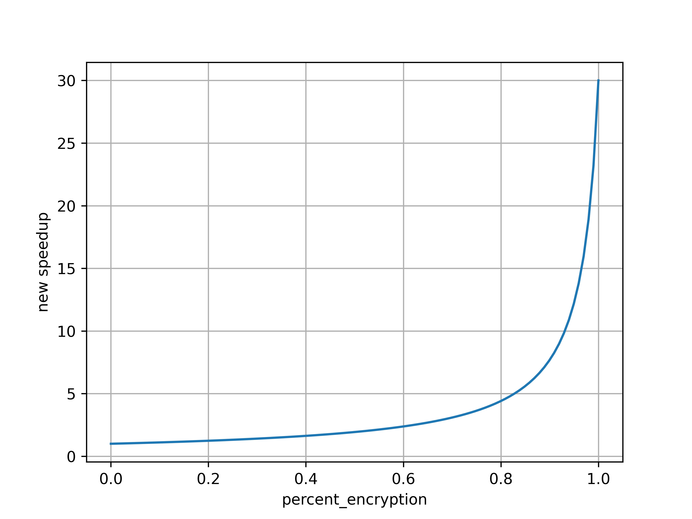

# Homework 1
**问题1** 在这个练习中，假设我们正在考虑为一个四核机器增加加密硬件以提升性能。在进行加密操作时，这台四核机器的运算速度比正常执行模式快30倍。我们将定义加密比(Percentage Encryption)为原计算执行中用于执行加密操作的时间所占的百分比。这种专用硬件会增加4%的功耗。
注：$Original\space Operation = Encryption + Uncrypted\space Operation$
(a) 绘制一张图表，令加密比(Percent Encryption)为横坐标，带来的速度提升(New speedup)为纵坐标。
$$
\text{speedup} = \frac{1}{p / 30 + (1 - p)}
$$

(b) 添加加密硬件后，需要多少百分比的加密才能实现3倍的速度提升？

- 令 $\text{speedup} = 3$, 解得 $p = 20/29\approx 69\%$

(c) 如果实现了3倍的速度提升，新的执行中会有多少百分比的时间用于执行加密操作？

$$
percentage_{time} = \frac{p / 30}{p / 30 + (1 - p)} = 6.9 \%
$$
(d) 假设您测得的加密百分比为50%。有一个硬件设计团队估计通过额外的大量投资可以进一步提高加密硬件的速度。您想知道是否添加第二个单元以支持并行加密操作会更有用。假设在原始程序中，90%的加密操作可以并行执行。在允许的并行化数量受限于加密单元数量的情况下，如果提供三个或六个加密单元，速度提升分别是多少？（分别回答三个和六个）

$$
\text{speedup} = \frac{1}{(p / 30) p^\prime / c + (p / 30)(1 - p^\prime) + (1 - p)}, p^\prime = 0.9, c = 3or6
$$

- 当提供 三个 加密单元时，$\text{speedup} = 1.97$
- 当提供 六个 加密单元时，$\text{speedup} = 1.98$

**问题2** 服务器农场(Server farm,也称服务器集群)（如Google和Yahoo!）提供足够的计算容量来处理一天中最高的请求率。假设大部分时间这些服务器只以60%的容量运行。进一步假设功耗与负载是非线性关系；也就是说，当服务器以60%的容量运行时，它们的功耗是最大功耗的90%。这些服务器可以关闭，但重新启动响应更多负载需要太长时间。现在提出了一个新系统，允许部分服务器快速重新启动，但服务器在这种“勉强存活”的状态下需要最大功耗的15%。
a. 关闭50%的服务器将节约多少功耗？

- 假设所有服务器的最大功耗总和为 $W$，当服务器以60%的容量运行时，它们的功耗是 $0.9W$，关闭一半的服务器后的功耗为 $0.45W$，将节约 $0.55W$

b. 将50%的服务器置于“勉强存活”状态将实现多少功耗节约？

- 将节约 $W - (0.9W \times 0.5 + 0.15W \times 0.5) = 0.475W$

c. 将电压降低30%并将频率降低50%将实现多少功耗节约？

- 将节约 $W - ((1 - 0.3)W\times 0.9\times 0.5) = 0.685W$

d. 将40%的服务器置于“勉强存活”状态，并关闭20%的服务器将实现多少功耗节约？

- 将节约 $W - (0.9W\times 0.4 + 0.15W\times 0.4) = 0.58W$

**问题3** 如果FP操作的比例为25%，FP操作的平均CPI=4.0，其他指令的平均CPI为1.33，FPSQR操作的比例为2%，FPSQR的CPI为20。假设有两种设计方案，分别把FPSQR操作的CPI和所有FP操作的CPI减为2。试利用CPU性能公式比较这两种设计方法哪一个更好。

- 第一种：将FPSQR操作的CPI减为2，平均 $CPI_1 = (0.25 \times 4 - 0.02 \times 20) + 0.02 \times 2 + 0.75 \times 1.33 = 1.6375$
- 第二种：将所有FP操作的CPI减为2，平均 $CPI_2 = 2 \times 0.25 + 1.33 \times 0.75 = 1.4975$
- 由于 $CPI_1 > CPI_2$，因此第二种好

**问题4** 两个 $N\times N$ 阶的矩阵相乘，时间为 $T_1 = CN^3$，其中 $C$ 为常数；在 $n$ 个节点的并行机上并行矩阵乘法的时间为 $T_n = (CN^3/n + bN^2/\sqrt{n})$ ，其中第一项代表计算时间，第二项代表通信开销，$n$ 为常数。试计算：
（1）固定负载时的加速比，并讨论其结果；
- 固定负载时，采用 Amdahl 定律
$$
S = \frac{p}{1 + f(p - 1) + W_op/W}
$$
根据题目提供的时间：
$$
S(n) = \frac{CN^3}{CN^3/n + bN^2/\sqrt{n}} = \frac{n}{1 + \frac{b\sqrt{n}}{CN}}
$$
因此 串行比例 $f = 0$，当矩阵规模 $N\to \infty$时，$S(n)\to n$，可以看作加速比随着并行节点的数量增加而上升

（2）固定时间时的加速比，并讨论其结果；
- 固定时间时，采用 Gustafson定律
$$
S^\prime = \frac{f + p(1 - f)}{1 + W_o / W}
$$
代入得：
$$
S(n) = \frac{n}{1 + \frac{bN^2 / \sqrt{n}}{CN^3}} = \frac{n}{1 + \frac{b}{CN\sqrt{n}}}
$$
因此，固定时间时，并行节点越多，加速比越大；当矩阵规模 $N\to \infty$时，$S(n)\to n$，可以看作加速比随着并行节点的数量增加而上升

（3）存储受限时的加速比，并讨论其结果。
- 存储受限时，采用Sun-Ni定律
$$
S^{\prime\prime} = \frac{f + (1 - f)G(p)}{f + (1 - f)G(p) / p + W_o / W}
$$
代入得：
$$
S(n) = \frac{G(n)}{G(n) / n + \frac{bN^2 / \sqrt{n}}{CN^3}} = \frac{G(n)}{G(n) / n + \frac{b}{CN\sqrt{n}}} = \frac{n}{1 + \frac{b\sqrt{n}}{CNG(n)}}
$$
当 $G(n) = 1$时，等同于 Amdahl 定律
当 $G(n) = n$时，等同于 Gustafson 定律
当 $G(n) > n$时，相应于计算机负载比存储要求增加得快，此时 Sun-Ni 加速均比 Amdahl 加速和Gustafson 加速高

**问题5** 你的公司刚买了一个新的32核处理器,你被指派来在这个处理器上优化软件。你将在这个系统上运
行四个应用程序,但资源需求不相等。假设表1.1中列出的系统和应用程序特性。

| Application |  A  |  B  |  C  |  D  |
|:-----------:|:---:|:---:|:---:|:---:| 
|resources needed %| 40 |  25 |  15 |  20 |
|parallelizable   %| 50 |  70 |  80 | 60  |
###### 
表1.1 4个应用的相关信息

假设它们都是串行运行的。假设当你以 $X\%$ 比例并行化程序的某个部分时,该部分可加速的部分为$X$ 
a. 如果整个32核处理器上运行应用程序A,与串行运行相比,会产生多大的加速比?

$$
S_a = \frac{t}{t\times 0.5 / n + t\times 0.5} = \frac{1}{0.5 / 32 + 0.5} = 1.939
$$

b. 如果整个32核处理器上运行应用程序D,与串行运行相比,会产生多大的加速比?

$$
S_b = \frac{t}{t\times 0.6 / n + t\times 0.4} = \frac{1}{0.6 / 32 + 0.4} = 2.388
$$

c. 假设应用程序A需要40%的资源,如果我们静态分配给它25%的核心,当A并行运行但其他所有应用串行运
行时,整体的加速比是多少?

- 即A被分配8个核心
$$
S_c = \frac{t_A + t_B + t_C + t_D}{0.5t_A / 8 + 0.5t_A + t_B + t_C + t_D} = \frac{1}{0.5\times 0.4 / 8 + 0.5\times 0.4 + 0.6} \approx 1.212
$$

d. 如果所有四个应用程序都静态分配了一些核心,相对于它们的资源需求百分比,所有应用程序都并行运
行,那么相对于串行运行整体的加速比是多少?

- 相对于它们的资源需求百分比，A分配13核，B分配8核，C分配5核，D分配6核
$$
\begin{align}
    t_A^\prime &= (0.5\times 0.4 / 13 + 0.5\times 0.4)t = 0.215t \\
    t_B^\prime &= (0.7\times 0.25 / 8 + 0.3\times 0.25)t = 0.097t \\
    t_C^\prime &= (0.8\times 0.15 / 5 + 0.2\times 0.15)t = 0.054t\\
    t_D^\prime &= (0.6\times 0.2 / 6 + 0.4\times 0.2)t = 0.1t\\
    S_d &= \frac{t}{t_A^\prime + t_B^\prime + t_C^\prime + t_D^\prime} = 2.146
\end{align}
$$
