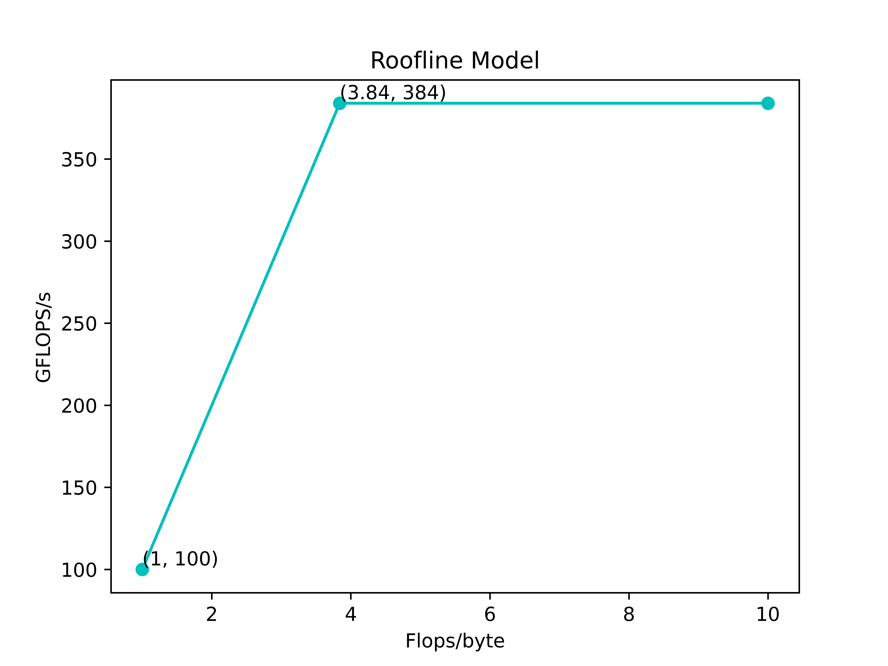

# Homework 3
## 习题 1
1. 在以下循环是否存在循环间相关？请给出理由
    ```c
    for (int i = 0; i < 100; i++) {
        A[i] = B[2 * i + 4]; 
        B[4 * i + 5] = A[i]; 
    }
    ```
    对于B寄存器，`a = 2, b = 4, c = 4, d = 5`，则 `GCD(c, a) = 2, d - b = 1 | GCD(c, a)`，因此存在循环间相关；对于A寄存器属于循环内相关
2. 在以下循环中，找出所有真相关、输出相关和反相关。通过重命名来消除输出相关和反相关
    ```c
    for(int i = 0; i < 100; i++){
        A[i] = A[i] * B[i];     /* S1 */
        B[i] = A[i] + c;        /* S2 */
        A[i] = C[i] * c;        /* S3 */
        C[i] = D[i] * A[i];     /* S4 */
    }
    ```
    - 真相关（写后读RAW）：S1 -> S2, S1 -> S4, S3 -> S4: A; 
    - 反相关（读后写WAR）：S1 -> S3, S2 -> S3: A; S1 -> S2: B; S3 -> S4: C
    - 输出相关（写后写WAW）：S1 -> S3: A
    - 重命名消除输出相关和反相关
        ``` c
        for(int i = 0; i < 100; i++){
            E[i] = A1[i] * B1[i];     /* S1 改A为E避免WAW
                                        改第二个A为A1避免WAR
                                        改B为B1避免WAR */
            B[i] = E[i] + c;          /* S2 */
            A[i] = C1[i] * c;         /* S3 改C为C1避免WAR*/
            C[i] = D[i] * A[i];       /* S4 */
        }
        ```
3. 考虑以下循环， S1 和 S2 之间是否存在相关？这一循环是否为并行的？如果不是，说明如何使其成为并行的
    ```c
    for (int i = 0; i < 100; i++) {
        A[i] = A[i] + B[i];     /* S1 */
        B[i + 1] = C[i] + D[i]; /* S2 */ 
    }
    ```
    S1 和 S2 之间不存在循环内相关，但是存在循环间相关，因为 S1 语句的 `B[i]` 需要由上一循环的 S2 语句的 `B[i + 1]` 获取，因此无法直接并行化，可以改为
    ```c
    A[0] = A[0] + B[0];
    for (int i = 0; i < 99; i++) {      // which can parallel
        B[i + 1] = C[i] + D[i];
        A[i + 1] = A[i + 1] + B[i + 1]; 
    }
    B[100] = C[99] + D[99]; 
    ```

## 习题 2
假定一个虚设 GPU 具有以下特性：
   - 时钟频率为 1.5 GHz
   - 包含 16 个 SIMD 处理器，每个处理器包含 16 个单精度浮点单元；
   - 片外存储器带宽为 100GB/S
   - 假定操作数可以被写为 y=Ax+b，每个操作数是 32 位，基本操作 CPI 假设为 1

1. 不考虑存储器带宽，假定所有存储器延迟可以隐藏，则这一 GPU 的峰值单精度浮点吞吐量为多少 GFLOP/s?
    $$
    \frac{16\times 16}{\frac{1}{1.5\text{G}}\text{G}} = 384 \text{GFLOP/s}
    $$
2. 在给定存储器带宽限制下，这一吞吐量是否可持续？如果不可持续，请绘制题目条件中的GPU 的 roofline 模型，横坐标为计算强度 (Flops/Byte)，纵坐标为性能 (GFLOP/s), 标注好题目假设对应的点的坐标
    - 不可持续，原因：每个操作数 32 位，一条指令要读取2个操作数 `x, y`(假设A，b是常量只读一次，忽略不计)，那么在达到峰值单精度浮点吞吐量的条件下
        $$
        384 \text{G/s}\times 32 \text{bits} \times 2 = 3072 \text{GB/s} > 100\text{GB/s}
        $$

        因此不可持续
    - roofline model: (1, 100) 和 (3.84, 384) 是按照 $100\text{GB/s}$ 计算得来，即左边那条斜线的斜率为 100，然后 (3.84, 384) 这个交点是由 $384 / 100 = 3.84$得来，之后右边的水平线对应的就是 $384 \text{GFLOP/s}$
    

## 习题 3

| 指令序号 | 指令 | 改变状态 | 返回 |
|:--------:|:---:|:--------:|:---:|
|1|p0 : read 120       | p0 b0 (S, 120, 00 20) | 00 20 |
|2|p0 : write 120 <− 80| p0 b0 (M, 120, 00 80); p3 b0 (I, 120, 0020) | - |
|3|p3 : write 120 <− 80| p3 b0 (M, 120, 00 80) | - |
|4|p1 : read 110       | p0 b2 (S, 110, 0030); p1 b2(S, 110, 0030); p3 b2(S, 110, 0030) | 00 30 |
|5|p0 : write 108 <− 48| p0 b1 (M, 108, 0048); p3 b1 (I, 108, 0008) | - |
|6|p0 : write 130 <− 78| p0 b0 (M, 130, 0078) | - |
|7|p3 : write 130 <− 78| p3 b3 (M, 130, 0078) | - |

## 习题 4
```c
p1: a = 1;           // s1
    print(b, c);     // s2

p2: b = 1;           // s3
    print(a, c);     // s4

p3: c = 1;           // s5
    print(a, b);     // s6
```

- 根据 DSM，可以保证 `s1 -> s2`, `s3 -> s4`, `s5 -> s6` 的顺序
- 那么 `00 11 10` 不是一个合法输出，因为一开始需要输出 `00`，那么就有两个进程还未赋值对应变量，假设是A打印了信息 `00`，即执行了 `s1, s2` 语句；之后要输出 `11`，那么假设是 B 打印了该信息，说明此时必须执行了 `s1, s2, s3, s4, s5` 才能保证；因此最后执行语句时只能是 `11` 而不是 `10`；因此 `00 11 10` 不是一个合法输出

## 习题 5
| 指令 | L1缓存最终状态 | L2缓存最终状态 | 存储器最终状态 | 读取返回值 |
|:----:|:-------------:|:-------------:|:-------------:|:---------:|
|a p0,0: read 100 | 不变 |不变 | 不变 | 00 10 |
|b p0,0: read 128 | P0,0.B1 `S 128 00 28` | L2,1.B2 `DM E 128 00 28` | M1.128 `DM C0 00 28` | 00 28 |
|c p0,0: write 128 <- 78 | P0,0.B1 `M 128 00 78` | L2,1.B2 `DM E 128 00 20` | M1.128 `DM C0 0020` | - |
|d p0,0: read 120 | P0,0.B1 `S 120 00 20` | L2,1.B0 `DS P3.1:E 120 00 20` | M1.120 `DS C0,C1 00 20` | 00 20 |