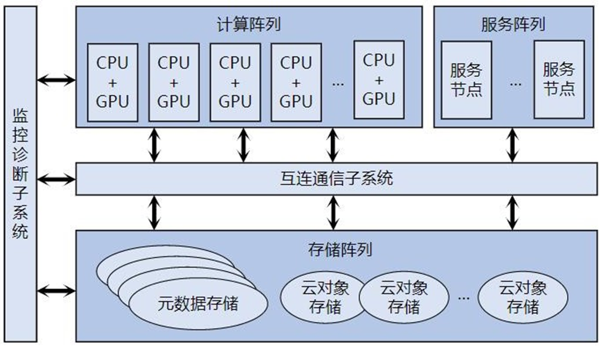
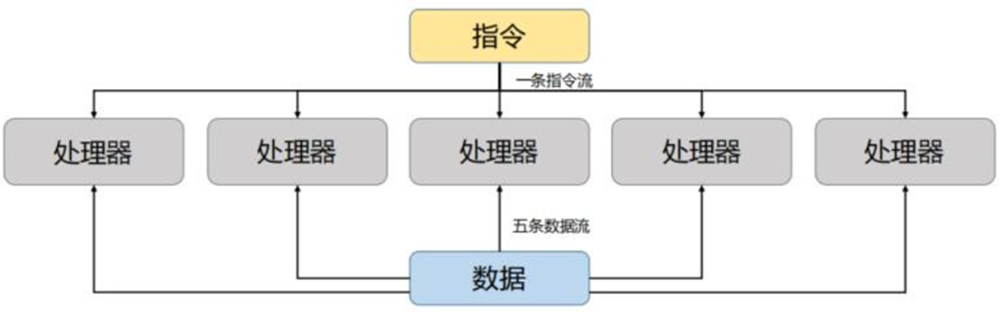
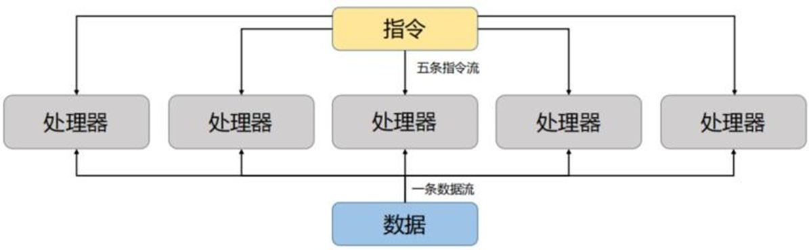
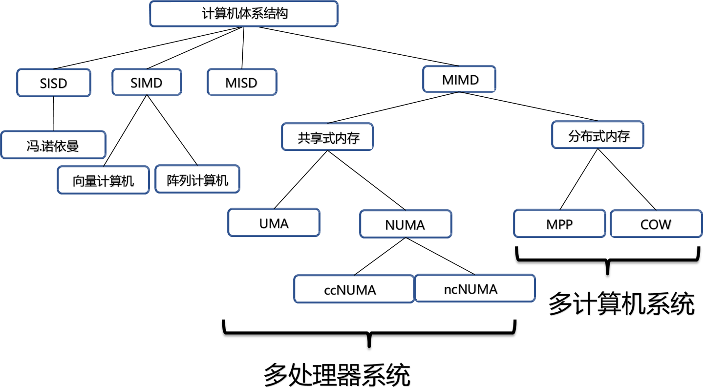
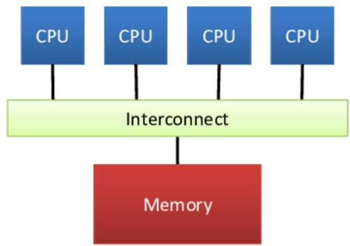
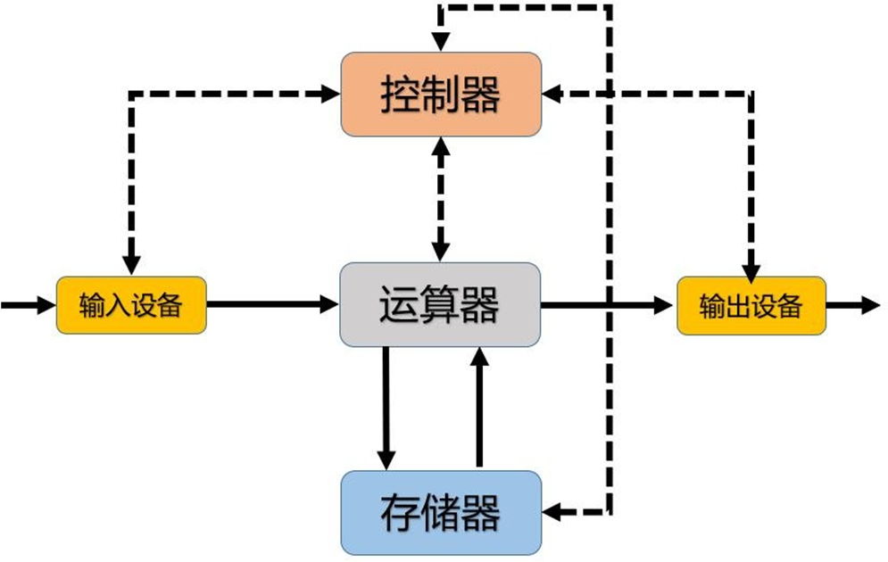
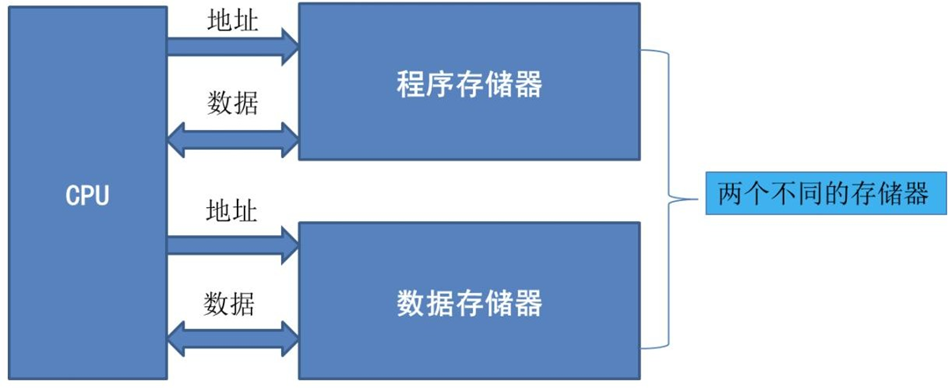
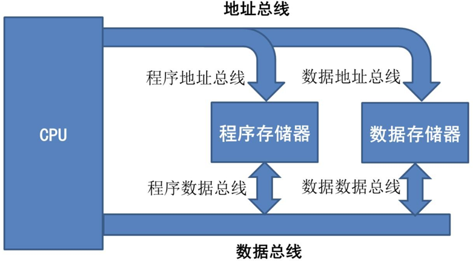

# 03 高性能计算机的体系结构
## 1. 超级计算机硬件
1. 超级计算机系统的硬件组成  由5个子系统组成
   1. 计算阵列：加速器常被用于增加计算的吞吐量，但是这种提升是以降低可编程性微代价而获得
   2. 存储阵列：层次式混合共享存储架构，实现大容量、高带宽、低延迟
   3. 服务阵列：
   4. 互连通信子系统：胖树拓扑结构
   5. 监控诊断子系统：实现了整体系统实时安全监测和诊断调试功能

## 2. 高性能计算机体系结构分类
1. Flynn分类法：为了解决原有分类方法的缺点，Flynn提出了一种基于数据流和指令流的并行性关系的分类方法
   1. 指令流：指机器执行的指令序列，即将一系列将数据送入数据处理单元进行修改的命令
   2. 数据流：指由指令流调用的数据序列，包括输入数据和中间结果，但不包括输出数据
   3. 多倍性：指在系统性能瓶颈部件上处于同一执行阶段的指令或数据的最大可能个数
2. 基于指令和数据划分

   |    | single instruction | multiple instruction |
   |:--:|:------------------:|:--------------------:|
   | single data  | SISD(传统冯诺依曼计算机)     | MISD(很少)         |
   | multiple data| SIMD(向量计算机)     | MIMD(多处理器,多计算机系统) |

3. SISD：一种传统的串行计算机；它从硬件上就不支持任何并行化计算，所有的指令都是串行执行；在一个时钟周期内只能执行一条数据流，因此这种机器被称为单指令单数据流机器
4. SIMD：可以实现数据级并行，对多个不同的数据流并行执行相同的数据处理操作 
   1. 该类型计算机主要适用于解决使用向量和矩阵等复杂科学计算和大规模工程计算的问题
   2. 这类机器大多应用于数字信号处理、图像处理等领域，SIMD根据类型又可以分为阵列计算机和向量计算机
      1. 阵列计算机：用一个单一的控制单元提供信号驱动多个处理单元同时运行
      2. 向量计算机：指专门对向量进行处理的计算机；它主要是以流水线结构为主，以向量作为基本操作单元，操作数和结果都以向量的形式存在
      3. 阵列计算机和向量计算机的区别
         1. 数据并行性：阵列计算机以数据并行为主，将任务分配给多个处理器，每个处理器独立执行相同操作的不同数据元素。每个处理器通过独立处理多个数据元素来实现并行计算；向量计算机则通过执行相同的操作来同时处理大型连续数据向量，具有更高的数据并行性
         2. 硬件架构：阵列计算机通常是通过大量的相同处理器节点组成的，每个节点都有自己的本地存储器，可以独立访问和处理数据；向量计算机则具有特殊的硬件向量寄存器，可以在单个指令周期内同时处理整个向量。它们通常具有更高的数据带宽和更强大的浮点性能
         3. 编程模型：阵列计算机通常使用数据并行语言或库来编写程序，例如MATLAB和CUDA等。程序员需要显式地指定数据元素之间的并行性和通信操作；向量计算机则具有专门的向量指令集和编程模型
      4. SIMT：一种并行计算中使用的模型，主要是将SIMD与多线程结合在一起，广泛应用于GPU上的计算单元中 
         1. SIMT比SIMD灵活：SIMT允许一条指令的多数据分开寻址；SIMD是必须连续在一起的片段；SIMT 可以支持编写线程级的并行代码，而 SIMD 不支持编写线程级的代码
         2. SIMD中的向量中元素相互之间可以自由通信；SIMD的向量存在于相同的地址空间；SIMT中的每个线程的寄存器都是私有的；SIMT线程之间只能通过共享内存和同步机制进行通信
5. MISD：每个处理器都按照不同指令流的要求来对同一个数据流以进行不同的处理；存在一定争议，有人认为这种类型的计算机至今都未出现；也有其他人认为有一些类似的例子，例如共享内存的多处理器系统和计算机中的流水线结构
6. MIMD：每个处理器都有自己的指令流，也可以和其他处理器共享指令流，对自己的数据进行处理；这是最广泛应用的并行体系结构的形式，现代流行的并行处理结构都可以划分为这一类
7. Flynn分类法局限
   1. 分类的对象主要是控制驱动方式下的串行处理和并行处理计算机，对于非控制驱动方式的计算机不适合
   2. 把两个不同等级的功能并列对待导致MISD计算机不存在
   3. 分类太粗，对流水线处理机的划分不明确，如标量流水线为SISD，向量流水线为SIMD 
8. MIMD：根据CPU组织和共享内存的方式再分类
   1. 共享式内存 
      1. 集中共享内存系统CSM：也叫对称多处理器系统SMP，一致存储访问系统UMA；每个处理器都能平等地访问存储器，所以它们访问存储器的延迟都是相同的，因此又被叫做一致存储访问系统；有一个存储器被所有处理器均匀共享；所有处理器访问共享的存储器的延迟相同；每个处理器可以拥有私有内存或高速缓存
      2. 分布式共享内存系统DSM：又叫非一致存储器访问系统NUMA：每个结点访问本地内存和访问其它结点的远程内存的延迟是不同的
   2. 分布式内存  在这种计算机体系结构中，每台计算机使用消息机制（如以太网）连接起来每台计算机都有自己的处理器，每个处理器都有自己的私有内存，私有内存只提供自己的处理器进行访问；其他的计算机不能直接访问，每个计算机都有自己独立的物理地址空间
      1. 大规模并行处理系统MPP：由成百上千台计算机组成的大规模高性能计算机系统；MPP中一般每个节点可以认为是一个没有硬盘的计算机；MPP节点一般只驻留操作系统内核，由一条I/O总线连接到同一个硬盘上面；MPP使用的网络一般情况不是我们使用的高速以太网，它一般使用制造商专有的定制高速通信网络
      2. 工作站集群系统COW：由大量的家用计算机或者工作站通过商用网络连接在一起而构成的多计算机系统；很多大公司的数据中心就是一个典型的例子

## 3. 非冯诺依曼体系结构
1. 传统的冯·诺依曼型计算机的缺点 
   1. 从本质上讲是采取串行顺序处理的工作机制；即使有关数据已经准备好，也必须逐条执行指令序列
   2. 指令与数据在同一存储器；在高速运行时，不能达到同时取指令和取操作数，从而形成了传输过程的瓶颈
2. 哈佛结构：是一种将程序指令存储和数据存储分开的存储器结构，它的主要特点是将程序和数据存储在不同的存储空间中，即程序存储器和数据存储器是两个独立的存储器，每个存储器独立编址、独立访问；目的是为了减轻程序运行时的访存瓶颈，极大的方便了并行处理 
3. 改进型哈佛结构虽然也使用两个不同的存储器，但它把两个存储器的地址总线合并了，数据总线也进行了合并；即原来的哈佛结构需要４条不同的总线，改进后需要两条总线 

