# 06 高性能计算机的互连网络
## 1. 互连网络体系结构
- 互连网络ICN：互连网络 (ICN) 是一种在终端之间传输数据的可编程系统；将我们的并行机器连接在一起；是并行计算机体系结构的核心 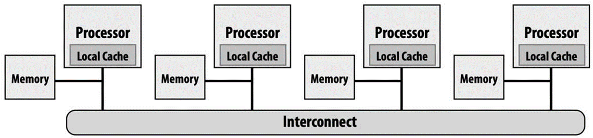

### 1. 互连网络分类与实现要求
1. 分类
   1. 广域网 WAN：连接分布在全球各地的系统，需要联网支持，有数百万设备互连，且最大互连距离数千公里
   2. 局域网 LAN：互连自主计算机系统；分布在一个机房或整个建筑物或校园，有数百台设备互连；最大互连距离几米到几十公里
   3. 系统区域网络 **SAN**：在一台 机器 内互连，例如多处理器系统中的互连，以及超级计算机中的互连；有数百到数千个设备互连，例如天河二号超级计算机（16K节点）；互连距离一般几十米
   4. 片上网络 **On-Chip Networks**：单芯片内互连，设备是微架构元素，例如缓存、目录、处理器核心
2. 互连网络的要求：延迟低、带宽高
3. 互连网络的实现主要集中于link和node级别，且通信协议必须要简单高效

### 2. Network Topology
1. 直径 diameter：节点之间的距离的最大值
2. 平均距离 average distance：所有节点之间的距离的平均值
3. 度degree：节点所连边的数量
4. 等分宽度bisection：当某一网络被切成相等的两半时，沿切口的最小边数

#### 1. direct interconnect
1. 直接互连网络：在直接互连网络中，并行系统的各个元件（例如处理器、存储器）之间的互连是基于固定连接的；按照拓扑结构是否完全连接还划分为完全连接互连网络和有限连接互连网络
2. 完全连接互连网络：每个节点都连接到网络中的所有其他节点，保证消息从任何源节点快速传递到任何目标节点（只需穿越一条链路）；缺点是：所需链路数量多，代价非常昂贵（尤其随着网络节点数的增加）
3. 有限连接互连网络：不提供从每个节点到网络中其他每个节点的直接链路一些节点之间的通信必须通过网络中的其他节点进行路由
   1. n维网格：有 `K0·K1·……·Kn-2·Kn-1` 个节点，其中 `Ki` 是第 `i` 维的节点数量，每个节点可以由n维坐标表示；这种拓扑结构通常是不对称的
      1. 一维线性阵列：也叫二近邻连接；节点数量为N时，当首尾没有相连时，内点度为2，直径N-1，对分宽度1；当首尾相连时，节点度为2，等分宽度2，直径 $\lfloor N/2 \rfloor$ 
      2. $\sqrt{N}\times\sqrt{N}$ 二维网孔：也叫四近邻连接，内节点宽度是4，直径 $2\sqrt{N}-2$ 且等分宽度为 $\sqrt{N}$
         1. 如果在垂直方向上带环绕，而水平方向呈蛇状，则2-D网孔就变成Illiac网孔了，此时节点度恒为4，直径 $\sqrt{N} - 1$，等分宽度 $2\sqrt{N}$
         2. 如果2-D网孔的垂直和水平方向均带环绕，则它就变成了2-D环绕（2-D Torus），其节点度恒为4，网络直径为 $2\lfloor\sqrt{N} /2 \rfloor$，等分宽度 $2\sqrt{N}$ 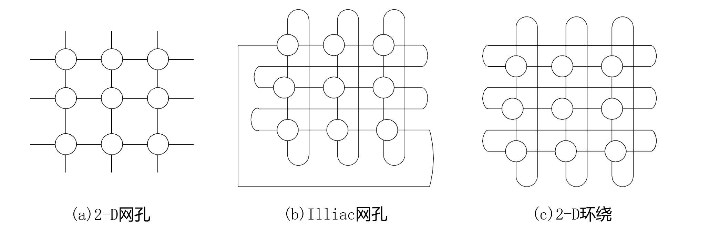
      3. 超立方：$2^n$个节点，节点度为n，直径为n，等分宽度为 N / 2 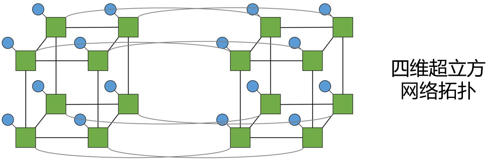立方环：嵌入，将网络中的各节点映射到另一个网络中去 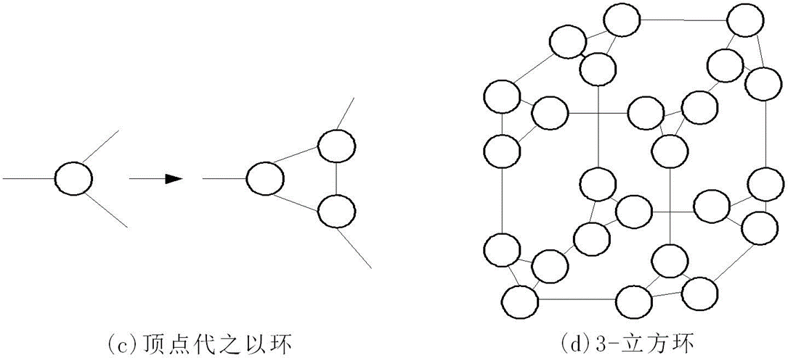
   2. 树形连接：二叉树中除了根节点和叶节点之外，每个内节点只与其父节点和两个子节点相连，故称为三近邻连接；节点度为3，对剖宽度为1，而树的直径为 $2(\lceil \log N \rceil - 1)$；如果尽量增大根节点度为N-1，其他所有节点都与它直接相连，此时直径缩小为2，变成了星形连接，其对剖宽度为 $\lfloor N / 2\rfloor$ ，从某种意义类似于基于总线的网络 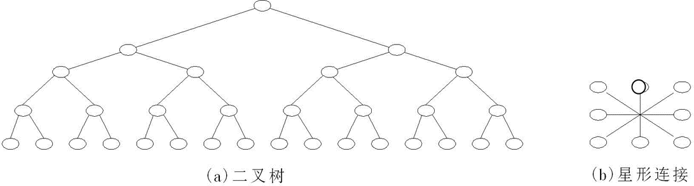 树的主要问题是根易成为通信瓶颈，因此胖树节点间的通路自叶向根逐渐变宽，它更像真实的树，连向根部的枝叉变得愈来愈粗 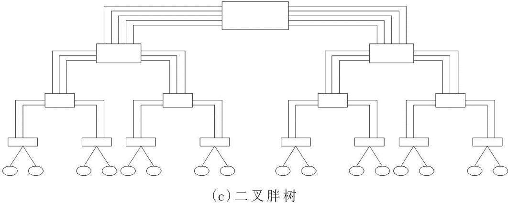
4. 直接互连网络特性 

#### 2. indirect interconnect
1. 间接互连网络：在间接互连网络中，输入和输出之间的互连模式可以通过交换元件节点连接改变；不使用固定连接，而是使用交叉开关、交换机或仲裁器来动态配置连接
2. 交叉开关crossbar：有多条输入线和输出线，形成交叉的互连线模式，通过闭合位于矩阵元素每个交叉点的开关，可以建立连接 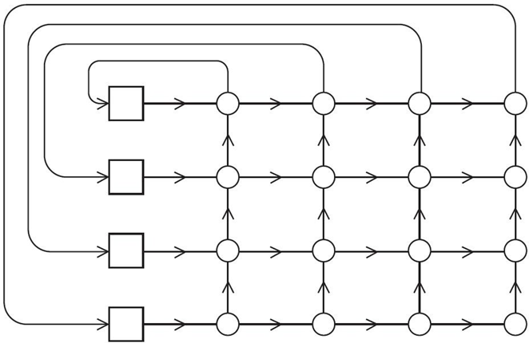
   1. 交叉开关点的状态 
      1. (a) 中该行输入允许访问相应的输出，而从上面发出的对同一输出的访问被阻塞
      2. (b) 中上面发出的输入允许访问输出，通过开关点的行输入不请求同一输出并可以传向其他开关
      3. (c) 中从上面发出的输入允许访问输出，但是通过开关点的行输入也请求同一输出，被阻塞
      4. (d) 中状态只用于要求交叉开关支持多播的情形 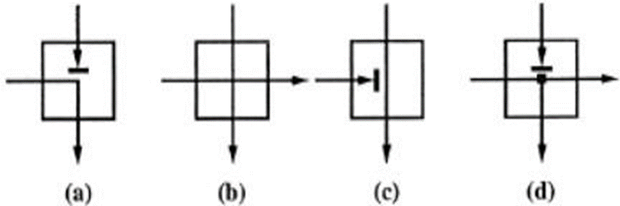
   2. 优点：交叉开关具有良好的带宽特性，且任意输入和输出都可实现无阻塞（两个节点之间的通信，不会阻塞其他节点之间的通信）
   3. 缺点：开关元素数量是和节点数平方相关，可扩展性差
3. 多级交换网络MIN
   1. 是一种由开关模块和级间连接构成的多级互连网络结构；旨在解决处理器和内存模块之间只有一条路径可用的问题，其提供了许多传输路径；各阶段通过级间连接模式相互连接，连接模式可以为洗牌交换、蝶式、立方体等
   2. Omega网络：一种典型的多级交换互连网络，常用于并行计算系统中作为互连网络；在每个阶段，相邻的输入对都连接到一个简单的交换元件，可以是直连，也可以交叉连接 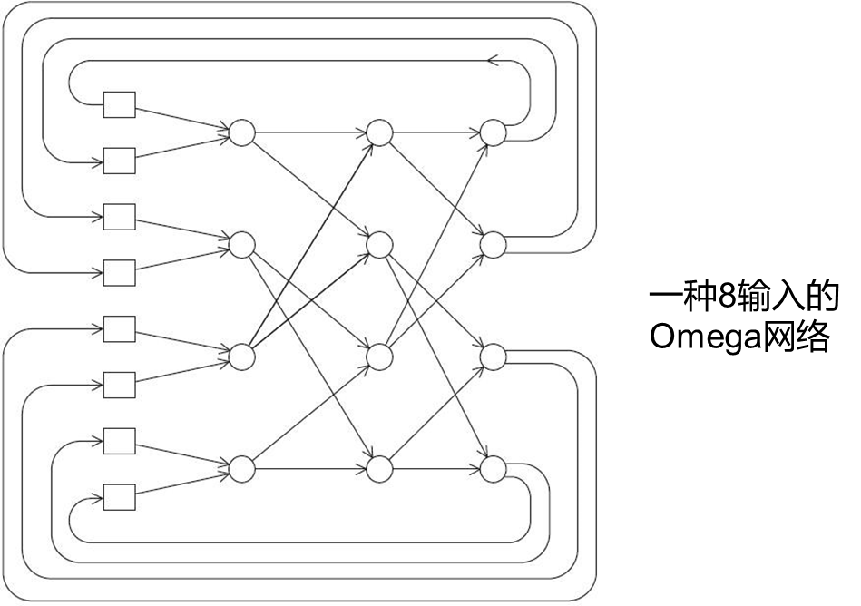

### 3. Flow Control Policy
1. 流控机制：需要为消息的传输和路由分配各种资源，其中包括：通道（或链路）、缓冲区、控制状态等；直接影响互连网络的吞吐量和时延
2. 基本逻辑单位：消息，消息由若干个包组成，包的大小通常是固定的，一条消息中包的数量是变化的，每个包的前面几个字节组成标识该包的包头；包可以进一步划分为固定长度更小的数据片 (flit)，片通常分为 3 种类型：寻径信息 (R)、顺序号 (S)、数据片 (D) 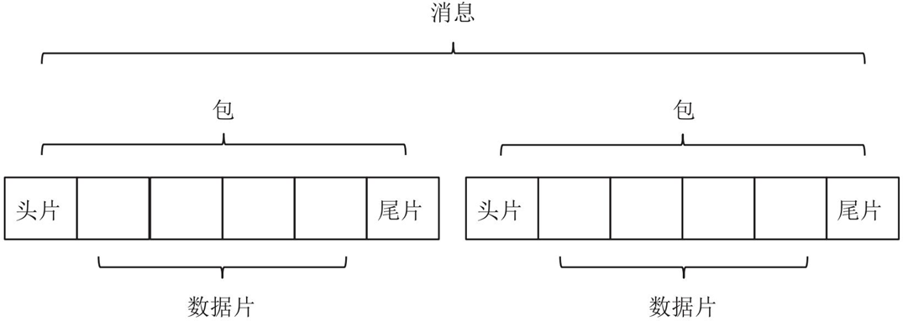
3. 流量控制策略根据粒度分为3类
   1. 基于消息的流量控制
      1. 粗粒度，主要基于线路交换，在传输消息之前，首先要在源节点和目的节点之间建立一个物理传输通道 
      2. 传输时延：L为包的长度，D为经过中间节点的个数，B为带宽，$L_t$ 是建立路径所需的小信息包的长度
         $$
         T = \frac{(D+1)L_t + L}{B}
         $$

      3. 优点：适于成批传送，可以实现较小的传输时延；在包传递的过程中，能够实现无竞争全速传递
      4. 缺点：在传输前必须**提前预留资源**，使用效率不高（静态占用，网络冲突较大）；同时如果两个节点之间传递的数据包较小，频繁的建立物理通路的成本开销会很高
   2. 基于包的流量控制
      1. 当一个包到达一个中间节点时，它首先被存放到缓冲区，当所要求的输出通道和接收节点的包缓冲区可用时，再将它传送给下一个节点；基于包的流量控制需要每个节点的缓冲区来存储传输中的数据包，缓冲区至少有一个完整的包大小
      2. 存储转发
         1. 存储转发：一个包在传输过程中，首先会被放入发送节点中的缓冲区，当发送节点的输出通道空闲，同时接收节点的缓冲区可用时，发送节点才会将包传递给接收节点 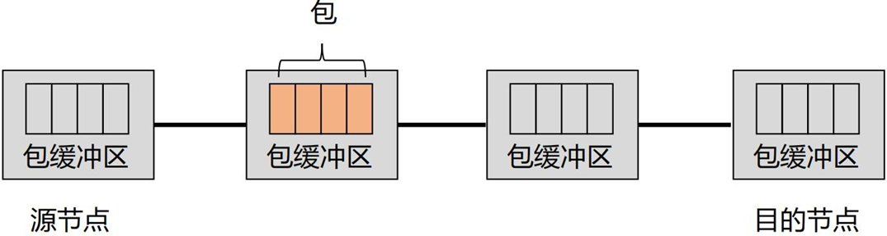
         2. 时延：L为包的长度，D为经过中间节点的个数，B为带宽
           $$
           T = \frac{(D+1)L}{B}
           $$
         3. 优点：占用物理通路的时间比较短，同时不需要提前进行资源的预留，因此通道的使用效率非常高
         4. 缺点：为了避免包丢失，每个节点需要提供一定容量的包缓冲区；同时，传输时延与节点间距离成正比，导致时延通常较大
      3. 虚拟直通
         1. 目的：降低存储转发传递过程中的高延迟，不同于存储转发策略，虚拟直通策略下，一个节点在接收到用作寻径的包头时，就开始路径选择，不必等到接收到全部的包后才进行路径选择，可以显著降低转发过程中的时延 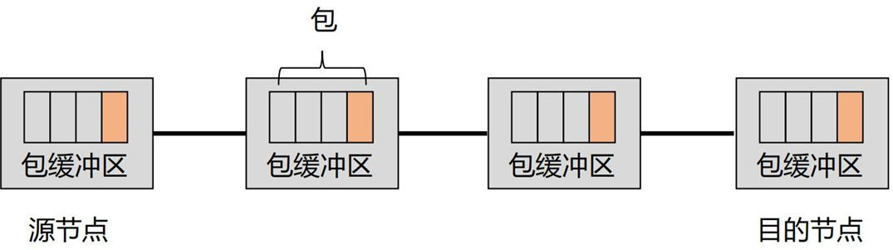
         2. 时延：L为包的长度，D为经过中间节点的个数，B为带宽，$L_h$ 是寻径头部的长度，一般 $L \gg L_h\times (D + 1)$
           $$
           T = \frac{D \times L_h + L}{B} \approx L / B
           $$
         3. 优点：通信延迟与节点数无关
         4. 缺点：每个节点需要有足够大的缓冲区；在最坏的情况下与存储转发方式的通信时延相同，经过的每个节点都阻塞，都需要缓冲
   3. 基于片的流量控制：将信息传递的基本单位划分为以片为粒度，将包划分为固定长度的片进行传递
      1. 虫孔路由wormhole
         1. 虫孔路由中每个包被划分成更小的片；地址信息只存储在头片中，交换节点在接收到头片时，根据其所包含的地址信息，立刻转发此片，同时物理通道保持此包所使用的通道占用状态，直到传输完最后一个片，同一个包中所有的片都在节点中顺序传输，后续数据片以跟随方式在头片后面移动的方式，像一个包在网络中蠕动一样，因此被称之为虫孔 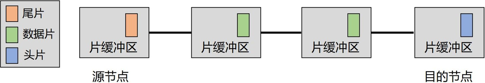
         2. L为包的长度，D为经过中间节点的个数，B为带宽，$L_f$ 是片的长度，一般 $L \gg L_f\times D$
           $$
           T = \frac{D \times L_f + L}{B} \approx L / B
           $$
         3. 队头阻塞问题：当一个头片由于所选择的通道忙或目的节点的片缓冲区满时，这个头片暂时无法立即进行转发，必须在目的节点的片缓冲区中进行等待，这时其他后续数据片也必须在源节点上等待
         4. 优点：每个节点的缓冲区较小；较低的网络传输时延；通道共享性好，利用率高；易于实现选播(anycast)和广播通信方式
         5. 缺点：一旦包中的一个片被阻塞时，那么整个包中全部片都将被阻塞，同时这个包还占用着节点资源，直至包中的片不再阻塞
      2. 虚拟通道virtual channel 
         1. 为了解决虫孔路由中的队头阻塞问题，在交换节点的输入输出端设置片缓冲队列，在不同的片对之间建立虚拟通道
         2. 一种逻辑上的通道；通过分配源节点的片缓冲区、目的节点的片缓冲区，以及共享两个节点之间的物理通道来实现；不同虚拟通道中的片可以传输，避免阻塞唯一的物理通道 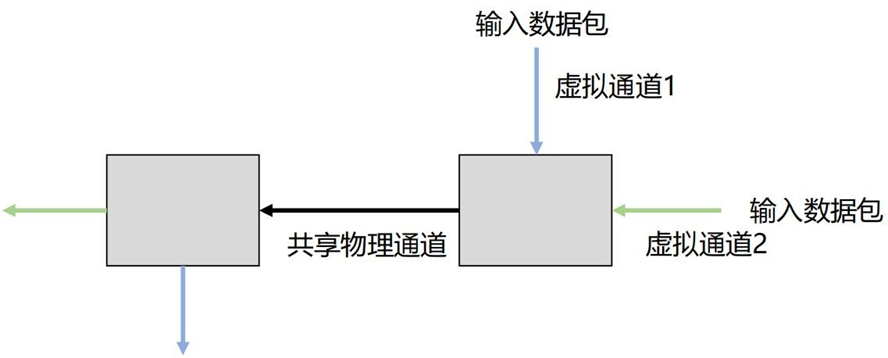 
   4. 总结：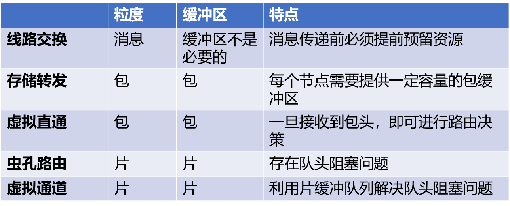
4. 基于信用量的流量控制：互连网络中，如果发生缓冲区溢出，包就会被丢弃，因此上游路由节点需要知道下游路由节点的缓冲区可用性
   1. 让源节点保持目的节点的输入缓冲区中空表项的数目
   2. 在节点中设置一个计数器，计数器初始化为输入缓冲区的大小
   3. 当发送一个数据片时，计数器-1，当计数器=0时，停止发送
   4. 当目的节点从输入缓冲区中取出一个数据片时，就将信用量退还给源节点，源节点计数器+1，如此保证输入缓冲区不会发生溢出 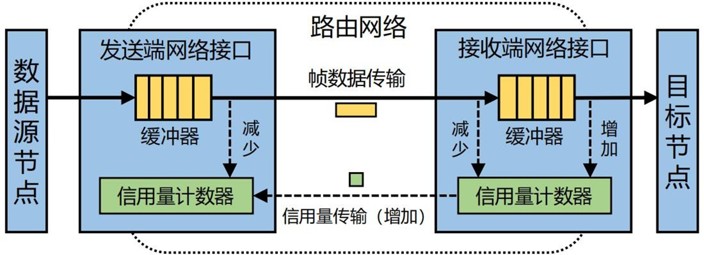

### 4. Routing Policy
1. 路由算法：用来确定源节点到目的节点之间的包传输路径的方法
   1. 依据互连网络的拓扑结构的特征设计
   2. 目的：实现数据传输的低时延以及负载均衡，同时避免死锁以及具备容错能力
2. 路由死锁问题：数据包由于等待被其他包占据的资源而阻塞，因此产生了网络中的相关
   1. 死锁：当发生互相等待资源的时候，就发生了死锁；可以将相关性画成图，当图中出现环时，说明出现了互相等待的情况，即有死锁
   2. 死锁恢复：在网络资源分配时不进行任何检查，通过某种机制检测死锁的发生，一旦发生死锁，就释放某些资源并分配给其他包，通常在释放资源的同时会进行包的丢弃
   3. 死锁避免：包通过网络时请求资源，但是只有当分配资源不破坏全局安全状态时，即不形成资源等待环时，包才可以获得资源
3. 路由算法分类
   1. 确定性路由
   2. 显式路由
   3. 自适应路由
4. 确定性路由
   1. 表明源节点和目的节点之间只有一条通路可选，无论选路路径上是否有通道出现阻塞，包都将沿着确定的选择路径进行传输
   2. 算术选路法：维度顺序路由（XY路由方法），即先在 X 轴方向上确定路由途径，再在 Y 轴的方向 上确定路由途径，不会出现死锁
   3. 源选路法：指源节点为消息建立一个头部，其中包含选路路径中包含的所有交叉开关的输出端口，消息路径的各个交叉开关从消息包头中读取端口号并将消息传递到相应的通道
      1. 优点：可以采用相对简单的交叉开关设计，通用性较好
      2. 缺点：需要设计较大的包头
   4. 查表选路法：通常为每个交叉开关构建并维护一张选路表，通过把包头部的选路域作为索引来在选路表上进行查询，得到输出端口；不足是选路表可能比较大，查询代价和时延较高
5. 显式路由：是为一类流量需求计算一个鲁棒的路由，从而有能力处理流量峰值
   1. 消息可以选择不同的路径，但是不考虑网络拥堵情况
   2. 当流量是可预测且稳定时，显式路由优化最坏情况下的性能可能会带来很高的成本，这可能会占用大部分时间
   3. valiant算法：随机选择一个中间目的地，先路由到它，然后从那里路由到最终目的地；Valiant 算法（暴力随机）是一种无关路由，一个包从源地址发到目的地址，会随机选择一个中间地址，这样可以实现负载均衡，但是会破坏本地性
   4. 如图 (a) 所示，随机选择中间节点会破环本地性，并且极大增加跳步数；Valiant 路由算法可以限制为只支持最短路径路由，如图 (b) 所示，限制只能在最短路径选择中间节点，共有三条可选路径Valiant 算法在源目标到中间目标的路由过程中 可以和 XY 路由结合使用，可以避免死锁，该算法相比确定性算法，可以使网络的负载更为均衡 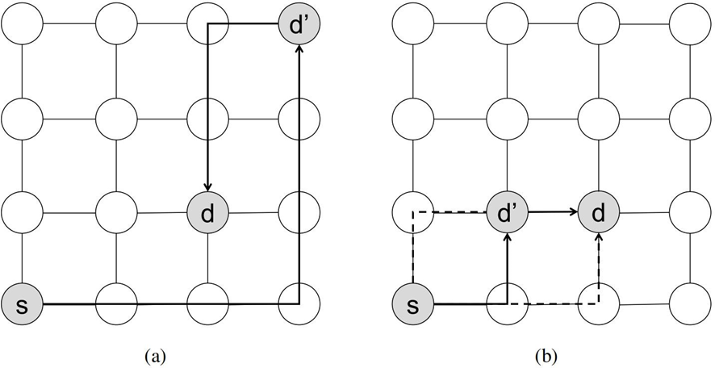
6. 自适应路由：是指路由通路每次都要根据资源和网络状态来选择；同一拓扑结构的互连网络有很多自适应路由选择实施方案；自适应路由的链路选择是由节点上的寻径器根据寻径中碰到的流量动态决定的该方法可以避开失效的或拥堵的节点，使网络更为负载均衡，提高了网络的吞吐率和链路的利用率
   1. 最小自适应：路由器根据网络状态（例如，下游缓冲区占用）来选择将数据包发送到哪个有效输出端口（productive output），该方法能针对局部堵塞进行优化并且可提高的链路利用率；有效输出端口是使数据包更接近其目的地的端口；最小自适应寻径仅沿着到达目的节点的最短路径引导数据包，每一次寻径都必须缩短到达目的节点的距离
   2. 非最小自适应：非最小自适应路由根据网络状态将经过错误路由的数据包到非有效输出端口（non-productive output）相比最小自适应，可以实现更好的网络利用率和负载均衡，但需要保证活锁自由；非最小自适应寻径的一种做法是：寻径器从不缓冲数据包，如果一个以上的数据包指向同一个输出链路，寻径器只将其 中的一个包送往其目的节点，而将其他的包传送到别的链路，而不管经过这些链路传送后是否会离目的节点更近
