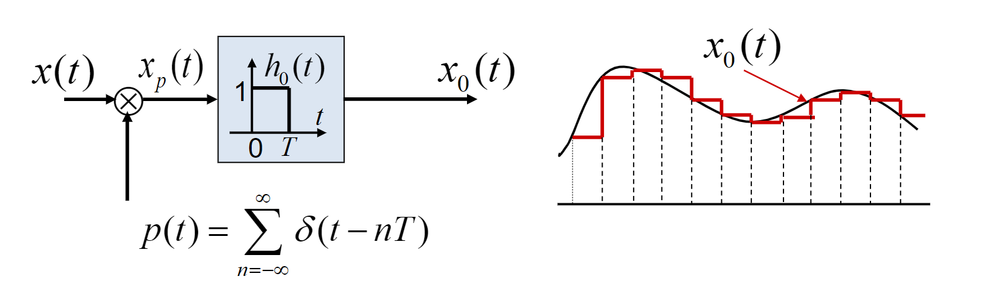
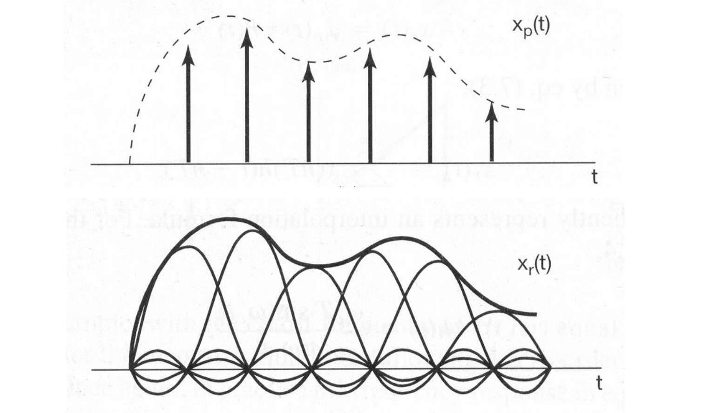

# 07 采样
## 1. 用样本表示连续时间信号: 采样定理
1. 采样
   1. 采样：在某些离散的时间点上提取连续时间信号值的过程
   2. 一般情况下，从连续时间信号采样所得到的样本序列不能唯一地代表原来的连续时间信号
2. 采样的数学模型
   1. 在时域：$x_p(t) = x(t)\cdot p(t)$
   2. 在频域：$X_p(j\omega) = \frac{1}{2\pi} X(j\omega) * P(j\omega)$ 
3. 冲激串采样 (理想采样)
   1. $p(t) = \sum_{n = -\infty}^{\infty}\delta(t - nT), T$为采样间隔 
   2. 在时域对连续时间信号进行理想采样，就相当于在频域将连续时间信号的频谱以$\omega_s$（采样频率）为周期进行延拓
   3. 要想使采样后的信号样本能完全代表原来的信号，就意味着要能够从 $X_p(j\omega)$ 中不失真地分离出$X(j\omega)$。这就要求 $X_p(j\omega)$ 在周期性延拓时不能发生频谱的混叠，因此
      1. $x(t)$必须是带限的，设最高频率分量为$\omega_M$
      2. 采样间隔 (周期) 不能是任意的，必须保证采样频率$\omega_s > 2\omega_M$
      3. 我们需要使用低通滤波器从 $X_p(j\omega)$ 中不失真地分离出$X(j\omega)$；低通滤波器截止频率必须满足
         $$
         \omega_M < \omega_c < (\omega_s - \omega_M)
         $$
         
4. Nyquist 采样定理：对带限于最高频率$\omega_M$的连续时间信号$x(t)$，如果以$\omega_s > 2\omega_M$的频率进行理想采样，则$x(t)$可以唯一地由其样本$x(nT)$来确定
5. 零阶保持采样 
   1. 零阶保持采样相当于理想采样后，再级联一个**零阶保持系统**
   2. 为了能从$x_0(t)$恢复$x(t)$，就要求零阶保持后再级联一个系统$H_r(j\omega)$，使得
      $$
      H_0(j\omega)H_r(j\omega) = T, |\omega| < \omega_c
      $$
      而
      $$
      H_0(j\omega) = \frac{2\sin(\omega T / 2)}{\omega}e^{-j\frac{\omega T}{2}}
      $$
      因此
      $$
      H_r(j\omega) = \frac{H(j\omega)}{H_0(j\omega)} = \frac{H(j\omega)}{2\sin(\omega T / 2) / \omega}e^{j\frac{\omega T}{2}}
      $$
## 2. 利用内插从样本重建信号
1. 理想内插：若 $h(t)$ 为理想低通滤波器的单位冲激响应, 则
$$
\begin{aligned}
x(t) & =x_{p}(t) * h(t)=\sum_{n=-\infty}^{\infty} x(n T) \delta(t-n T) * h(t) \\
& =\sum_{n=-\infty}^{\infty} x(n T) h(t-n T)
\end{aligned}
$$
表明：理想内揷以理想低通滤波器的单位冲激响应作为 内揷函数。
$$
\begin{array}{l}
h(t)=T \cdot \frac{\sin \omega_{c} t}{\pi t}=\frac{\omega_{c} T}{\pi} \operatorname{Sa} \omega_{c} t=\operatorname{Sa} \omega_{c} t \quad\left(\omega_{c}=\frac{1}{2} \omega_{s}=\frac{\pi}{T} \right) \\ 
\Rightarrow x(t)=\sum_{n=-\infty}^{\infty} x(n T) \cdot \operatorname{Sa}\left[\omega_{c}(t-n T)\right]
\end{array}
$$
2. 这种内插也称为时域中的带限内插 
## 3. 欠采样的效果—频谱混叠
1. 如果采样时，不满足采样定理的要求，就会在 $x(t)$ 的频谱周期延拓时，出现**频谱混叠**的现象
2. 此时，即使通过理想内插也得不到原信号。但是恢复所得的信号$x_r(t)$与原信号$x(t)$在采样点上仍将具有相同的值
