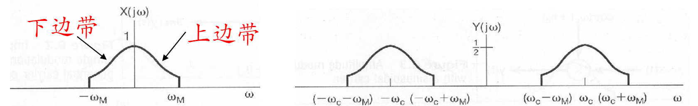
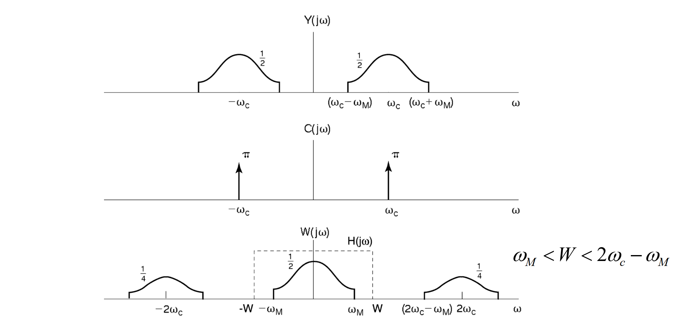
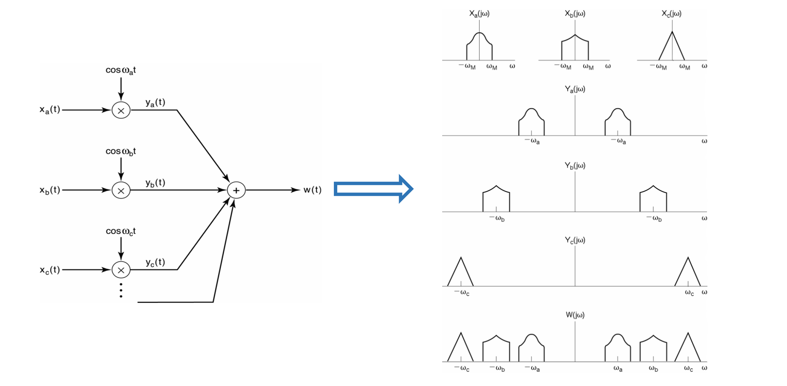
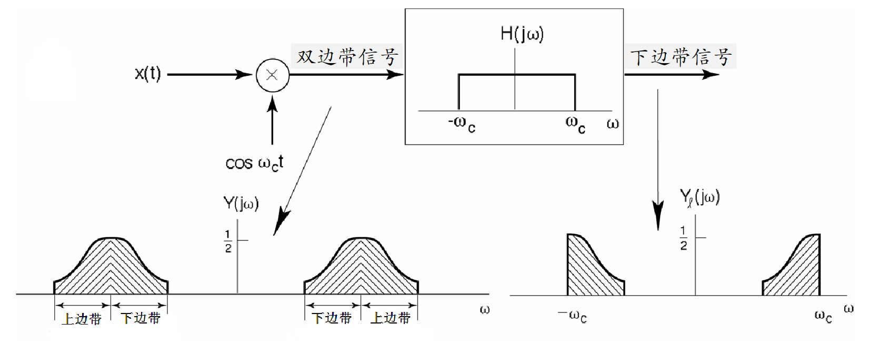
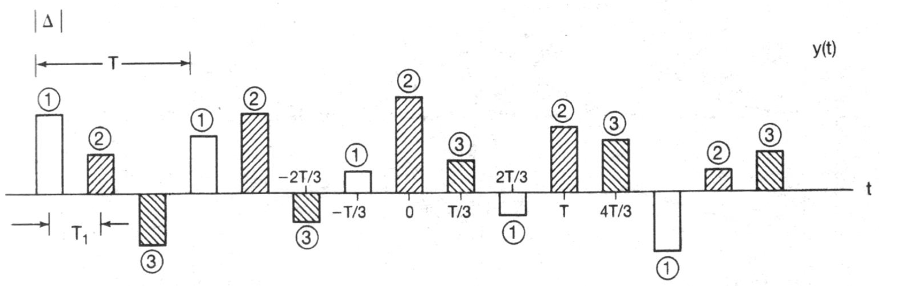

# 08 通信系统
## 1. 正弦幅度调制
1. 幅度调制的数学模型是乘法器
   1. 其中 $x(t)$ 为调制信号(基带信号)，$c(t)$ 为载波，$y(t) = x(t)c(t)$ 为已调信号
   2. 当$c(t) = \cos(\omega_c t + \theta_c)$ 时称为 **正弦幅度调制**
2. 正弦幅度调制
   1. 如果暂时不考虑载波的相位，即$y(t) = x(t)\cos\omega_c t$
   2. 此时载波$c(t) = \cos(\omega_c t)$的频谱为
      $$
      C(j\omega) = \pi[\delta(\omega - \omega_c) + \delta(\omega + \omega_c)]
      $$
   3. 则已调信号的频谱为
      $$
      Y(j\omega) = \frac{1}{2\pi}X(j\omega) * C(j\omega) = \frac{1}{2}\left\{ X[j(\omega - \omega_c)] + X[j(\omega + \omega_c)]\right\}
      $$
      
> 由于在已调信号的频谱中同时保留了基带信号的上、下两个边带，故称其为 **双边带调制**
## 2. 正弦幅度调制的解调
1. 同步解调：将 $y(t)$ 再次与同频载波相乘，有：
   $$
   w(t) = y(t)\cos\omega_c t = x(t)\cos^2\omega_c t = \frac{1}{2}x(t) + \frac{1}{2}x(t)\cos2\omega_c t
   $$
   只要滤掉第二项即可实现对 $x(t)$ 的恢复 
2. 技术关键
   1. 解调端所用的载波必须与调制时的载波同频
   2. 所用的理想低通滤波器的截止频率必须满足
      $$
      \omega_M < W < 2\omega_c - \omega_M
      $$
3. 载波相位的影响：假定调制时载波 $c_{1}(t)=\cos \left(\omega_{c} t+\theta_{c}\right)$ , 解调时载波  $c_{2}(t)=\cos \left(\omega_{c} t+\varphi_{c}\right)$ , 则
      $$
      \begin{aligned}
        w(t) & =x(t) \cos \left(\omega_{c} t+\theta_{c}\right) \cdot \cos \left(\omega_{c} t+\varphi_{c}\right) \\
        & =\frac{1}{2} x(t) \cos \left(\theta_{c}-\varphi_{c}\right)+\frac{1}{2} x(t) \cos \left(2 \omega_{c} t+\theta_{c}+\varphi_{c}\right)
      \end{aligned}
      $$
      
      1. 当 $\theta_{c}-\varphi_{c}$  不随时间变化, 而且  $\theta_{c}-\varphi_{c} \neq \pm \pi / 2$  时,  $\cos \left(\theta_{c}-\varphi_{c}\right)$  是一个常数。此时, 可以通过前面讨 论的解调系统实现解调
      2.  当$\theta_{c}-\varphi_{c} = \pm \pi / 2$时，由于$\cos(\theta_c - \varphi_c) = 0$因此不能实现解调
4. 可见，必须要求调制和解调时所使用的载波不仅要严格同频，而且要同相。因此这种解调方法称为同步解调
## 3. 频分多路复用
1. 频分复用可以大大提高信道频率资源的利用率 
2. 对频分多路复用信号解调时，首先要解复用：从复用信号的频谱中利用带通滤波器滤出所需的一路信号，然后对该路信号进行解调
## 4. 单边带正弦幅度调制
- 单边带正弦幅度调制信号的产生：一种方法是通过滤波法实现，即利用边带滤波器，滤除一个边带 
## 5. 脉冲串作载波的幅度调制
1. 脉冲串载波调制：幅度调制的载波信号时脉冲串
   1. 频域分析
      $$
      C(j\omega) = 2\pi\sum_{k = -\infty}^{\infty}a_k\delta(\omega - \frac{2\pi}{T}k)
      $$
      其中
      $$
      a_k = \frac{\Delta}{T}\text{sinc}(\frac{\Delta}{T}k) = \frac{\sin\frac{\Delta\pi}{T}k}{\pi k}
      $$
      因此
      $$
      \begin{aligned}
      Y(j\omega) &= \frac{1}{2\pi}X(j\omega) * C(j\omega) \\
      &= \sum_{k = -\infty}^{\infty}a_k X\left[j(\omega - \frac{2\pi}{T}k) \right]
      \end{aligned}
      $$
   2. 信号可恢复则要求
      $$
      2\omega_M < \frac{2\pi}{T}
      $$
   3. 恢复信号的低通滤波器截止频率$W$满足
      $$
      \omega_M < W < \omega_c - \omega_M
      $$
2. 时分多路复用
   1. 脉冲串载波调制时能否解调出$x(t)$ ，与脉宽$\Delta$无关
   2. 从时域角度，在一个周期内可以为每一路信号分配一个时隙，只要各路信号的时隙彼此不重叠，就可以实现多路信号的同时传送
## 6. 脉冲幅度调制
1. 脉冲幅度调制
   1. 以脉冲串作载波的幅度调制，在载波的宽度内是以调制信号的原始波形为传送对象的
   2. 而实际上只要满足Nyquist采样率，在每个时隙内只需要传送信号的一个样本值 $x(nT)$
   3. 脉冲幅度调制就是用$x(t)$在各时隙的样本值$x(nT)$去调制载波脉冲的幅度
2. 脉冲幅度调制的时分多路复用
   - 对时分复用的脉冲幅度调制信号，在理想情况下，若各路信号在传输过程中不发生波形失真，在接收端只要通过采样判决就可以解复用 
3. 数字脉冲幅度调制与脉冲编码调制
   1. 脉冲幅度调制中信号的样本$x(nT)$往往被量化成数字信号$x[n]$，从而造成已调脉冲的幅度只能有有限个可能的幅度值，称为 **数字脉冲幅度调制**
   2. 数字化的脉冲幅度调制信号可以表示成一组二进制码字，其中的每一位称为一个比特
   3. 在传输数字脉冲幅度调制信号时，为了传输可靠，防止误码，往往要在传输前将其通过编码变换成另一个二进制序列，这种经编码后的脉冲幅度调制就称为 **脉冲编码调制**