# 09 拉普拉斯变换
## 1. 拉普拉斯变换
1. 双边拉普拉斯变换的定义
   1. 双边拉普拉斯变换：$X(s) = \int_{-\infty}^{\infty}x(t)e^{-st}dt$，称为$x(t)$的双边拉普拉斯变换，其中$s = \sigma + j\omega$
   2. 当$\sigma = 0, s = j\omega$， 就是傅里叶变换
   3. $x(t)$ 的拉普拉斯变换就是$x(t)e^{-\sigma t}$的傅里叶变换
      $$
      X(s) = \int_{-\infty}^{\infty}x(t)e^{-st}dt = \int_{-\infty}^{\infty}[x(t)e^{-\sigma t}]e^{-j\omega t}dt = \mathcal{F}[x(t)e^{-\sigma t}]
      $$
2. 收敛域
   1. 不同的信号可能会有完全相同的拉普拉斯变换表达式，只是它们的**收敛域**不同。拉普拉斯变换的表达式只有连同相应的收敛域，才能和信号建立一一对应的关系
   2. ROC：使拉普拉斯变换收敛的复数s的集合，称为拉普拉斯变换的 **收敛域(ROC)**
   3. 并非s平面上的任何复数都能使拉普拉斯变换收敛，也不是任何信号的拉普拉斯变换都存在
3. 拉普拉斯变换的ROC及零极点图
   1. 若$X(s)$是有理函数$M\frac{\prod_i(s - \beta_i)}{\prod_j(s - \alpha_j)}$，则分子多项式的根称为**零点**，分母多项式的根称为**极点**
   2. 将$X(s)$的全部零点和极点表示在s平面上，就构成了零极点图。零极点图及其收敛域可以表示一个$X(s)$ ，最多与真实的 $X(s)$相差一个常数因子$M$
   3. 对于多个有理函数，拉普拉斯变换的收敛域是各个收敛域的 **公共部分** 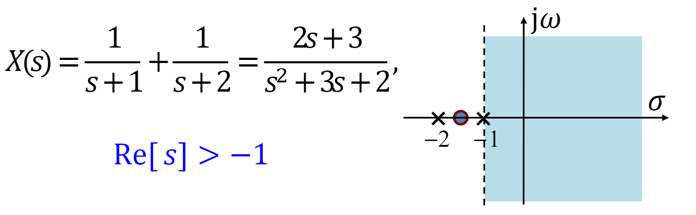

## 2. 拉普拉斯变换的收敛域
- ROC的性质
  - ROC是𝑠平面上平行于$j\omega$轴的带形区域
  - 有理拉普拉斯变换在其ROC内无任何极点
  - 绝对可积的时限信号其ROC是整个𝑠平面
  - 右边信号的ROC位于𝑠平面内一条平行于$j\omega$轴的直线的右边
  - 左边信号的ROC位于𝑠平面内一条平行于$j\omega$轴的直线的左边
  - 双边信号的ROC如果存在，一定是𝑠平面内平行于$j\omega$轴的带形区域
  - 当$X(s)$是**有理函数**时，其ROC总是由$X(s)$的极点分割的。ROC必然满足下列规律
    - 右边信号的ROC一定位于$X(s)$最右边极点的右边
    - 左边信号的ROC一定位于$X(s)$最左边极点的左边
    - 双边信号的ROC可以是任意两相邻极点之间的带形区域 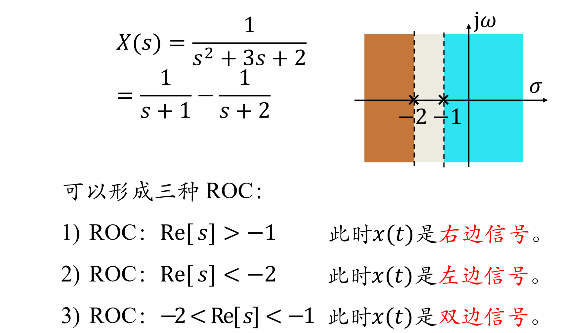

## 3. 拉普拉斯反变换
1. 拉普拉斯反变换
   1. $x(t) = \frac{1}{2\pi j}\int_{\sigma-j\infty}^{\sigma + j\infty}X(s)e^{st}ds$
   2. 拉普拉斯反变换表明：$x(t)$ 可以被分解成复振幅为$\frac{1}{2\pi j}X(s)ds$的复指数信号$e^{st}$的线性组合
2. 求拉普拉斯反变换的部分分式展开法
   1. 将$X(s)$展开为部分分式
   2. 根据$X(s)$的ROC，确定每一项的ROC
   3. 利用常用信号的变换对与拉普拉斯变换的性质，对每一项进行反变换

## 4. 由零极点图对傅里叶变换几何求值
1. 单零点情况：$X(s) = s - a$，零点$s = a$，可以作两个矢量$\vec{s}_1, \vec{a}$，则$X(s_1) = \vec{s}_1 - \vec{a}$称为 **零点矢量**，长度为$|X(s_1)| = |\vec{s}_1 - \vec{a}|$，幅角为$\measuredangle X(s_1)$
2. 单极点情况：$X(s) = \frac{1}{s - a}$，极点$s = a$，可以作两个矢量$\vec{s}_1, \vec{a}$，则$\vec{s}_1 - \vec{a}$称为 **零点矢量**，$|X(s_1)| = \frac{1}{|\vec{s}_1 - \vec{a}|}$，幅角为$\measuredangle X(s_1) = -\measuredangle (\vec{s}_1 - \vec{a})$
3. 一般情况：对有理函数形式的$X(s)$
   $$
   X(s) = \frac{N(s)}{D(s)} = M\frac{\prod_{i = 1}^R(s - \beta_i)}{\prod_{j = 1}^P(s - \alpha_j)}
   $$
   因此有
   $$
   \begin{align*}
      |X(s_1)| &= |M|\frac{\prod_{i = 1}^R|\vec{s}_1 - \vec{\beta}_i|}{\prod_{j = 1}^P|\vec{s}_1 - \vec{\alpha}_j|} \\
      \measuredangle X(s_1) &= \sum_{i=1}^R\measuredangle(\vec{s}_1 - \vec{\beta}_i) - \sum_{j=1}^P\measuredangle(\vec{s}_1-\vec{\alpha}_j)
   \end{align*}
   $$
   - 从所有零点向$s_1$点作零点矢量，从所有极点向$s_1$点作极点矢量。所有零点矢量的长度之积**除以**所有极点矢量的长度之积为$|X(s_1)|$
   - 所有零点矢量的幅角之和**减去**所有极点矢量的幅角之和即为$\measuredangle X(s_1)$
   - 当$s_1$取为$j\omega$轴上的点时，即为傅里叶变换的几何求值。考查𝑠1在$j\omega$轴上移动时所有零、极点矢量的长度和幅角的变化，即可得出$X(j\omega)$的幅频特性和相频特性 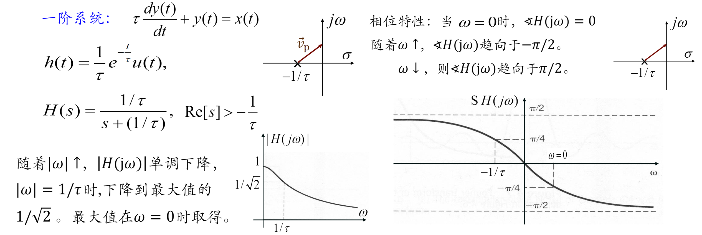

## 5. 拉普拉斯变换的性质
1. 线性：若 $x_1(t)\leftrightarrow X_1(s), ROC:R_1; x_2(t)\leftrightarrow X_2(s), ROC:R_2$ ，则 $ax_1(t) + bx_2(t)\leftrightarrow aX_1(s) + bX_2(s)$ 且 $ROC$ **至少**为 $R_1\cap R_2$
2. 时移性质：若$x(t)\leftrightarrow X(s),ROC:R$，则$x(t - t_0)\leftrightarrow X(s)e^{-st_0}, ROC$不变
3. s域平移：若$x(t)\leftrightarrow X(s),ROC:R$，则$x(t)e^{s_0t}\leftrightarrow X(s - s_0), ROC:R + Re[s_0]$
4. 时域尺度变换：若$x(t)\leftrightarrow X(s),ROC:R$，则$x(at) \leftrightarrow \frac{1}{|a|}X(\frac{s}{a}), ROC:aR$；可见：若信号在时域尺度变换，其拉普拉斯变换的ROC在s平面上作**相反**的尺度变换
5. 共轭对称性：若$x(t)\leftrightarrow X(s),ROC:R$，则$x^*(t) \leftrightarrow X^*(s^*), ROC:R$
   1. 另外，当$x(t)$为实信号时，有$x(t) = x^*(t), X^*(s) = X(s^*)$
   2. 即实信号的拉普拉斯变换其复数零、极点必**共轭成对**出现
6. 卷积性质：若 $x_1(t)\leftrightarrow X_1(s), ROC:R_1; x_2(t)\leftrightarrow X_2(s), ROC:R_2$ ，则 $x_1(t)*x_2(t)\leftrightarrow X_1(s)X_2(s), ROC$ **至少**为 $R_1\cap R_2$
7. 时域微分：若$x(t)\leftrightarrow X(s),ROC:R$，则$\frac{dx(t)}{dt}\leftrightarrow sX(s),ROC$包括$R$，有可能扩大
8. s域微分：若$x(t)\leftrightarrow X(s),ROC:R$，则$-tx(t)\leftrightarrow \frac{dX(s)}{ds},ROC:R$
9. 时域积分：若$x(t)\leftrightarrow X(s),ROC:R$，则$\int_{-\infty}^tx(\tau)d\tau\leftrightarrow \frac{1}{s}X(s),ROC$包括$R\cap(Re[s] > 0)$
10. 初值定理：如果 $x(t)$ 是 **因果信号**，且在 $t = 0$ **不包含奇异函数**，则$x(0^+) = \lim_{s\to\infty}sX(s)$
11. 终值定理：如果 $x(t)$ 是 **因果信号**，且在 $t = 0$ **不包含奇异函数**，$X(s)$除了在$s = 0$可以有单阶极点外，其余极点均在s平面的左半边，则 $\lim_{t\to\infty}x(t) = \lim_{s\to 0}sX(s)$

## 6. 常用拉普拉斯变换对
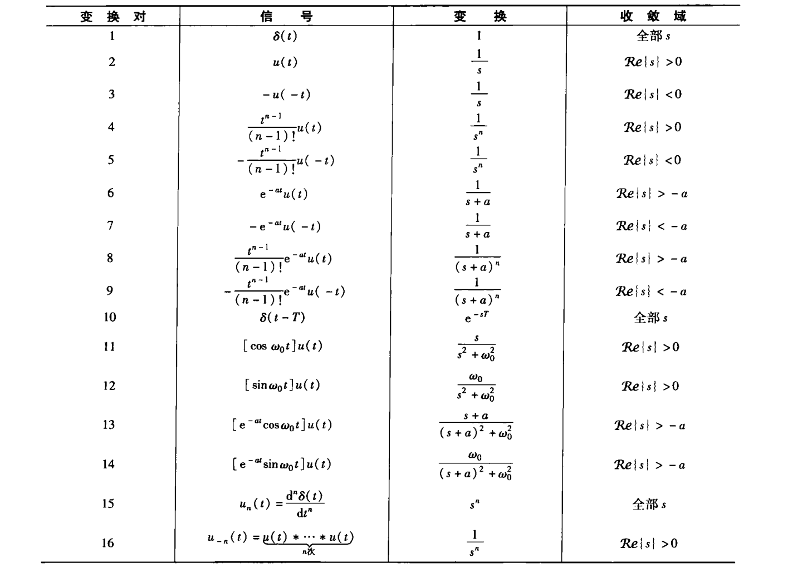
## 7. 用拉普拉斯变换分析与表征LTI系统
1. 系统函数的概念
   1. 以卷积特性为基础，可以建立LTI系统的拉普拉斯变换分析方法，即 $Y(s) = X(s) \cdot H(s)$，其中$H(s)$称为**系统函数**或转移函数、传递函数
   2. 这些方法成立的本质原因在于复指数函数是一切LTI系统的特征函数：以$e^{st}$为基底分解信号时，系统的输出响应就是 $X(s)H(s)$
   3. $H(s)$连同相应的ROC也能完全描述一个LTI系统
2. 用系统函数表征LTI系统
   1. 因果性：如果$t < 0, h(t) = 0$，则系统是**因果的**（如果$t > 0, h(t) = 0$，则系统是**反因果的**）
      1. 因果系统的$h(t)$是右边信号，其$H(s)$的ROC必是最右边极点的右边；当 H(s)是**有理函数**时，逆命题成立
      2. 反因果系统的$h(t)$是左边信号，其$H(s)$的ROC必是最左边极点的左边；当 H(s)是**有理函数**时，逆命题成立
   2. 稳定性：$\int_{-\infty}^{\infty}|h(t)|dt<\infty$
      1. LTI系统**当且仅当**其$H(s)$收敛域 **包括** $j\omega$**轴** 时稳定
      2. **因果稳定**系统的$H(s)$收敛域为包括$j\omega$轴的s右半平面
3. 由线性常系数微分方程描述的LTI系统
   - 由线性常系数微分方程描述的系统：$\sum_{k = 0}^N a_k\frac{d^k y(t)}{dt^k} = \sum_{k=0}^M b_k\frac{d^k x(t)}{dt^k}$，两边进行拉普拉斯变换，可得
      $$
      H(s) = \frac{Y(s)}{X(s)} = \frac{\sum_{k=0}^M b_ks^k}{\sum_{k = 0}^N a_ks^k}
      $$
4. 巴特沃斯滤波器设计
   1. 通常巴特沃斯滤波器的特性由频率响应的模平方函数给出。对$N$阶巴特沃斯低通滤波器有
      $$
      |B(j\omega)|^2 = B(j\omega)B^*(j\omega) = \frac{1}{1 + (j\omega / j\omega_c)^{2N}}
      $$
   2. 巴特沃斯低通滤波器幅频特性具有以下特点
      1. 在$\omega = 0$处，前 $2N − 1$ 阶导数为零，具有最大平坦性
      2. 在通带、阻带内单调下降
      3. 在$\omega = \omega_c$处，幅度降为最大值的$1 / \sqrt{2}$ 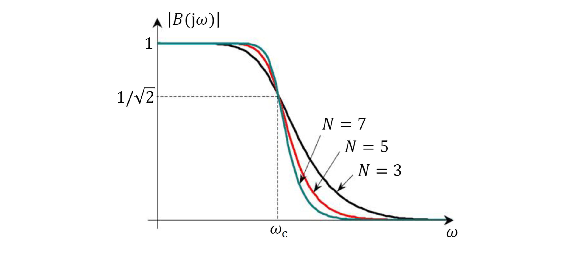
   3. 巴特沃斯滤波器的冲激响应应该是实信号，共有2𝑁个极点 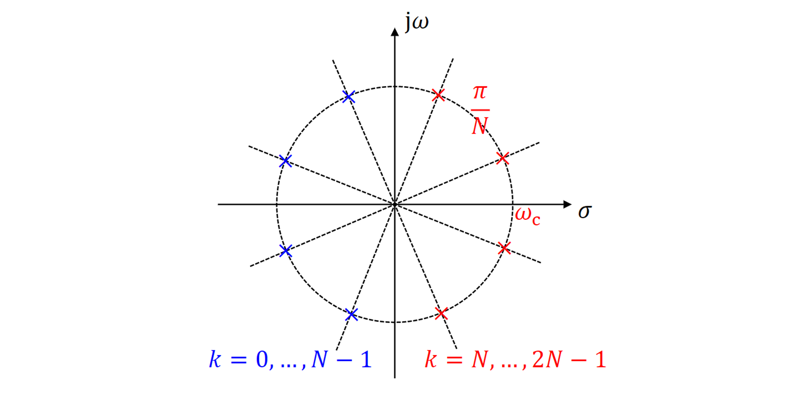
## 8. 系统函数的代数属性与方框图表示
1. 系统互联时的系统函数
   1. 级联：$H(s) = H_1(s)\cdot H_2(s), ROC:$ 包括 $R_1\cap R_2$
   2. 并联：$H(s) = H_1(s) + H_2(s), ROC:$ 包括 $R_1\cap R_2$ 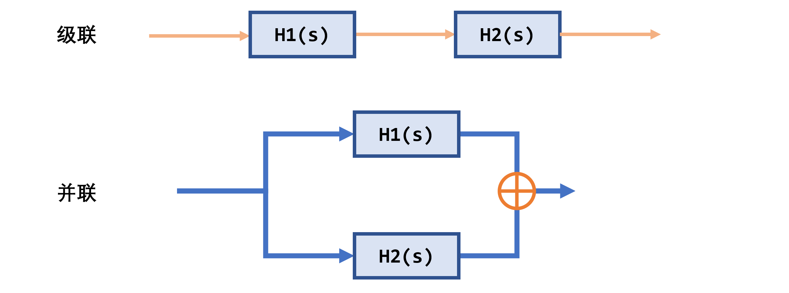
   3. 反馈联结
      $$
      \begin{align*}
         X_1(s) &= X(s) - G(s)Y(s) \\
         Y(s) &= X_1(s)H_1(s) = [X(s) - G(s)Y(s)]H_1(s) \\
         H(s) &= \frac{Y(s)}{X(s)} = \frac{H_1(s)}{1 + G(s)H_1(s)}, ROC \subseteq R_1\cap R_2
      \end{align*}
      $$
      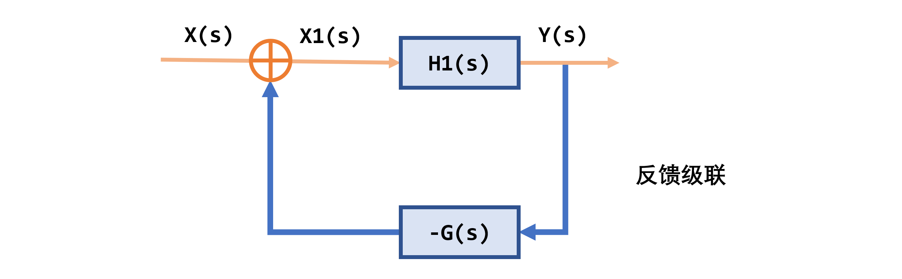
2. 微分方程和有理系统函数描述的因果LTI系统方框图 
   1. 单极点 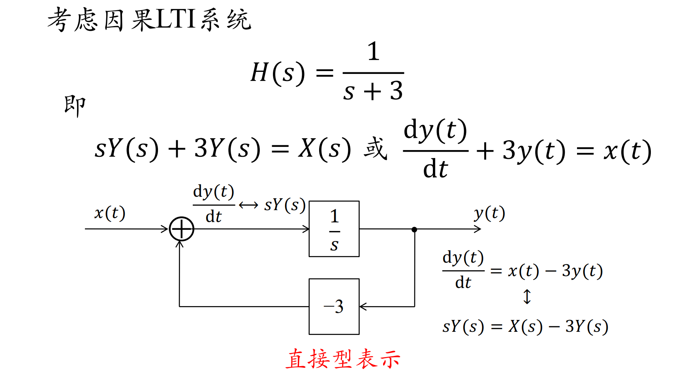
   2. 单极点 + 单零点 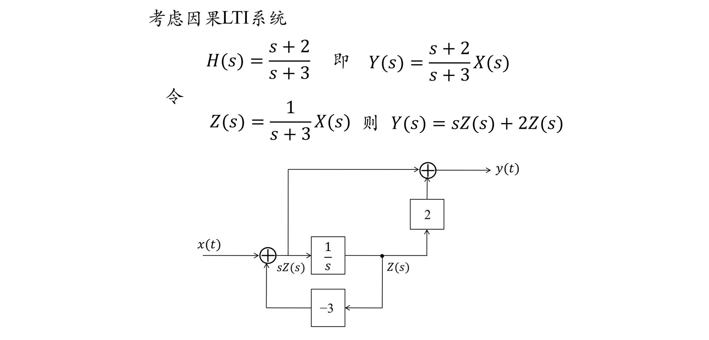
   3. 二阶因果LTI系统 
      1. 直接型：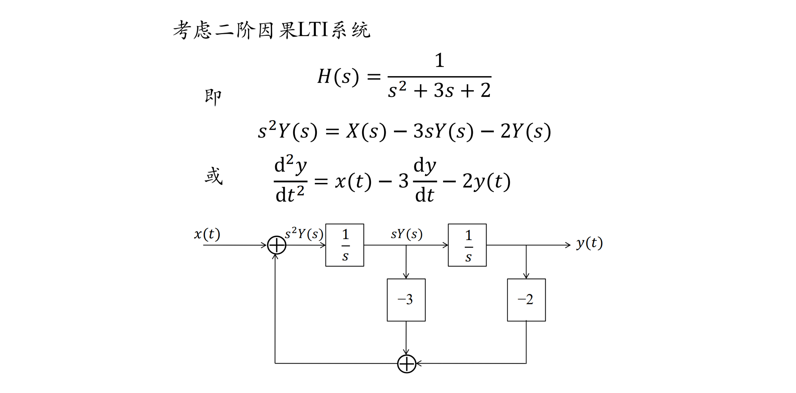
      2. 级联型表示 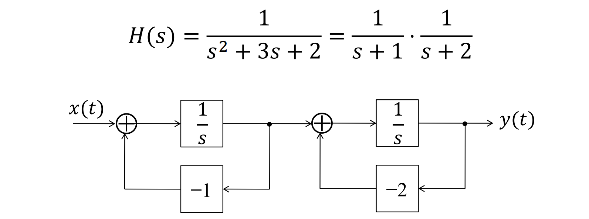
      3. 并联型表示 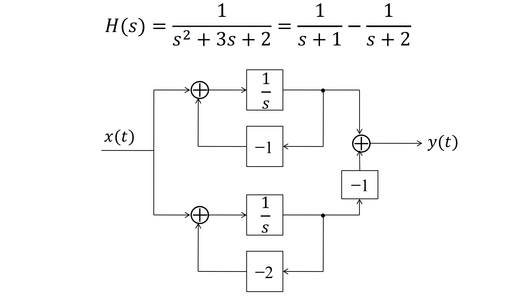

## 9. 单边拉普拉斯变换
1. 定义
   1. **单边拉普拉斯变换** 是仅考虑信号在$0^-$之后部分的双边拉普拉斯变换；显然，因果信号的双边拉普拉斯变换和单边拉普拉斯变换完全相同
      $$
      \chi(s) = \int_{0^-}^{\infty}x(t)e^{-st}dt
      $$
      反变换
      $$
      x(t) = \frac{1}{2\pi j}\int_{\sigma - j\infty}^{\sigma + j\infty}\chi(s)e^{st}ds
      $$
      注意：单边拉普拉斯反变换仅给出信号在$0^-$后的取值
   2. 单边拉普拉斯变换的ROC位于最右边极点右边
2. 单边拉普拉斯变换的性质
   由于单边拉普拉斯变换是特殊的双边拉普拉斯变换，因此其大部分性质与双边拉普拉斯变换相同，但也有一些区别：**时域微分**
   $$
   \begin{align*}
      x(t) &\leftrightarrow \chi(s) \\
      \frac{dx(t)}{dt} &\leftrightarrow s\chi(s) - x(0^-) \\
      \frac{d^2x(t)}{dt^2}&\leftrightarrow s^2\chi(s) - sx(0^-) - x^\prime(0^-)
   \end{align*}
   $$
3. 利用单边拉普拉斯变换求解微分方程
   1. 单边拉普拉斯变换特别适合于求解具有非零初始条件的线性常系数微分方程（**增量线性系统**）
   2. 最终的响应分为 **零输入响应** 和 **零状态响应** 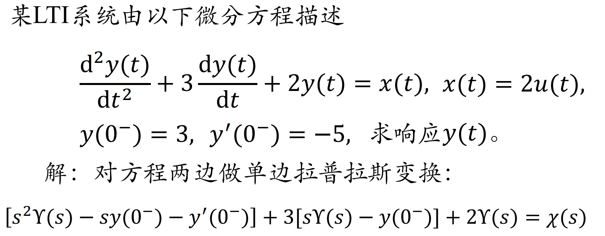 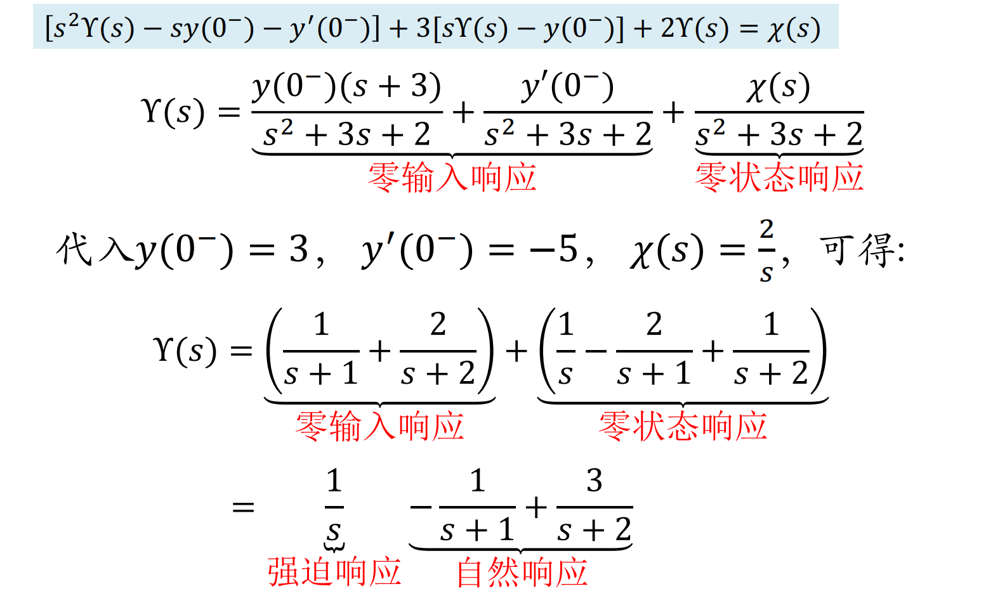