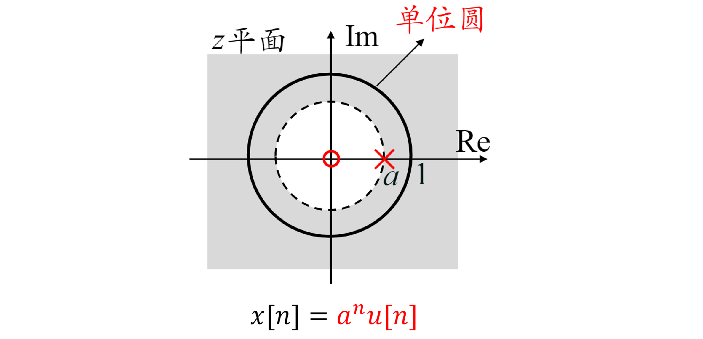
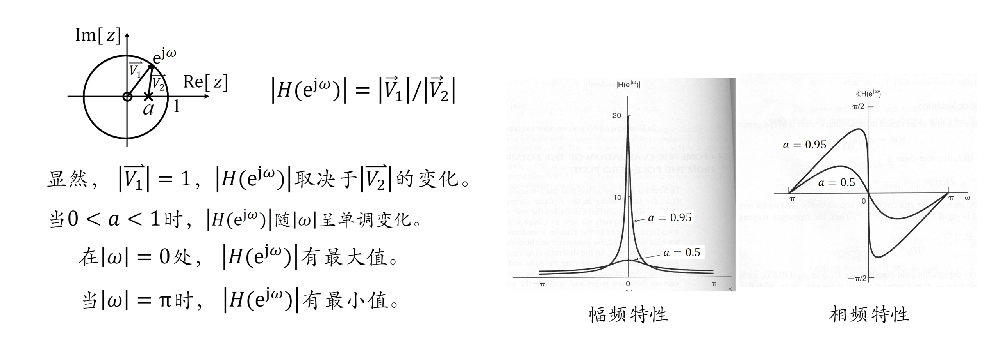
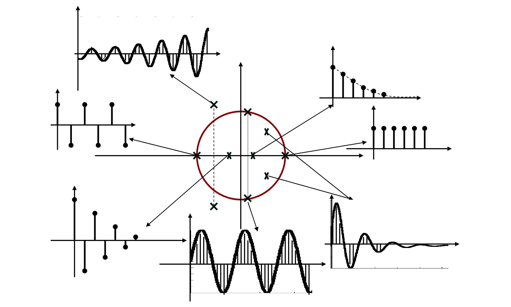
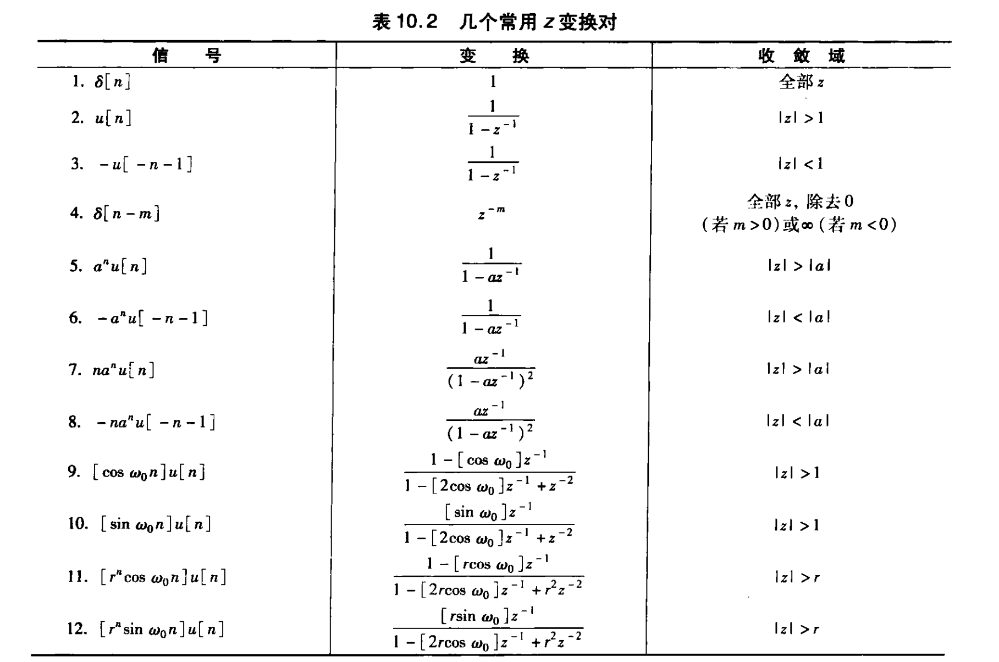
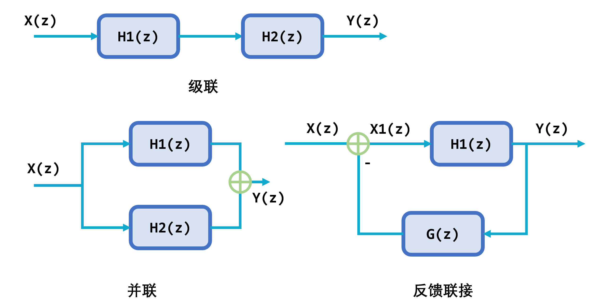
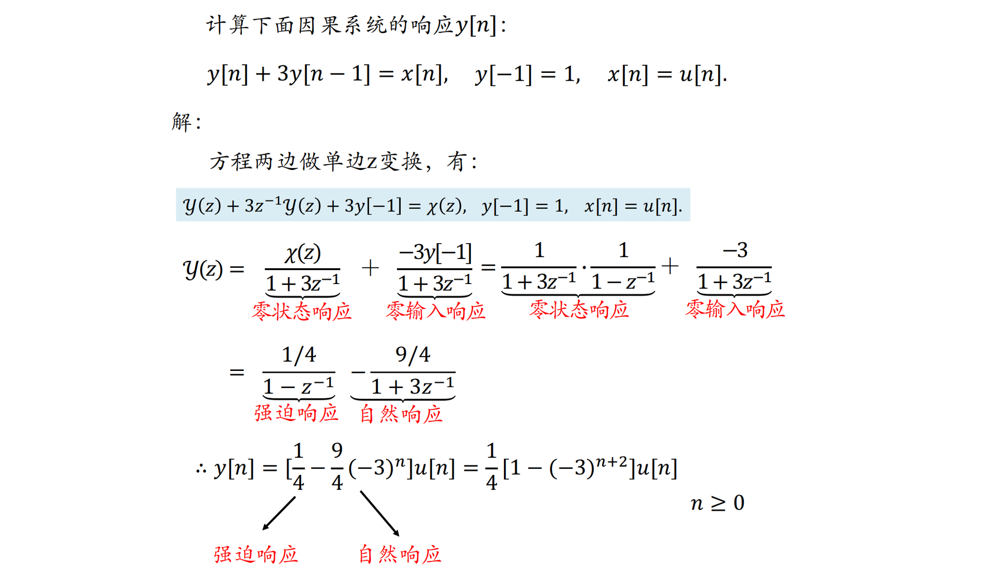

# 10 z变换
## 1. 双边z变换
1. 双边z变换的定义
   1. 定义：$X(z) = \sum_{n = -\infty}^{\infty}x[n]z^{-n}, z = re^{j\omega}$
   2. 当$r = 1$时，就是离散时间的傅里叶变换，即单位圆上的z变换
   3. $X(re^{j\omega}) = \sum_{n = -\infty}^{\infty}x[n]r^{-n}e^{-j\omega n} = \mathcal{F}[x[n]r^{-n}]$，即$x[n]$的z变换等价于$x[n]r^{-n}$的离散傅里叶变换
2. z变换的收敛域
   1. 并非任何信号的z变换都存在，并非z平面上的任何复数都能使$X(z)$收敛。z平面上那些能使$X(z)$收敛的点的集合，就构成了$X(z)$的 **收敛域**
   2. z变换的ROC一般是z平面上 **以原点为中心的环形区域**
   3. 当$X(z)$是有理函数时，其ROC的边界总是由$X(z)$的极点所在的圆周界定的
   4. 如果$x[n] = \sum_ix_i[n]$，则其ROC是各个$x_i[n]$的ROC的 **公共部分**。若没有公共区域则表明$x[n]$的z变换不存在 
3. 零极点图
   1. 如果$X(z)$是有理函数，将其分子多项式与分母多项式分别因式分解可以得到
        $$
        X(z) = \frac{N(z)}{D(z)} = M\frac{\prod_i(z- z_i)}{\prod_p(z - z_p)}
        $$
        在z平面上标出$X(z)$的全部零、极点，即为 **零极点图**
   2. 性质
      1. z变换的ROC一般是z平面上 **以原点为中心的环形区域**
      2. 在ROC内，$X(z)$无极点
      3. 有限长序列的ROC是整个z平面，但可能不包括$z = 0, |z| = \infty$；原因：有限长序列可以表示为$\sum_{n = N_1}^{N_2}x[n]z^{-n}$，当$N_1<0, N_2>0$的时候，会包含$z$的正幂次项和负幂次项，因此ROC不能包括$z = 0, |z| = \infty$
      4. 右边序列的ROC是某个圆的**外部**，但可能不包括$|z| = \infty$
      5. 左边序列的ROC是某个圆的**内部**，但可能不包括$z = 0$
      6. 双边序列的z变换如果存在，则ROC必是一个 **环形区域**
      7. 当且仅当$|z| = \infty$在ROC内时，$x[n]$为 **因果序列**
      8. 当且仅当$z = 0$在ROC内时，$x[n]$为 **反因果序列**

## 2. z反变换
1. z反变换：$x[n] = \frac{1}{2\pi j}\oint X(z)z^{n-1}dz$，即$\omega$从$0\to 2\pi$，$z$沿着ROC内半径为 r 的圆积分一周
2. 反变换的求取
   1. 部分分式展开法：$X(z)$ 为有理函数时，可见其展开为部分分式$X(z) = \sum_i\frac{A_i}{1 - a_iz^{-1}}$，求出所有极点$a_i$，根据总的ROC，确定每一项的ROC，求出每一项的反变换
   2. 幂级数展开法：将$X(z)$展开为幂级数：$X(z) = \cdots + x[-n]z^n + \cdots + x[-1]z + x[0] + x[1]z^{-1} + x[2]z^{-2} + \cdots + x[n]z^{-n} + \cdots$，展开式中$z^{-n}$的系数就是$x[n]$
      1. 非有理函数形式：泰勒级数展开法
      2. 有理函数形式：可采用长除法

## 3. 由零极点图对离散时间傅里叶变换几何求值
1. 方法：与拉普拉斯变换时完全类似：考查动点**在单位圆上移动一周**时，各极点矢量和零点矢量的长度与幅角变化的情况，即可反映频率特性
2. 例子：一阶因果离散时间LTI系统 $y[n] - ay[n-1] = x[n]$ 求得一个零点和一个极点如图所示 

## 4. z变换的性质
1. 线性：若 $x_1[n]\leftrightarrow X_1(z), ROC:R_1; x_2[n]\leftrightarrow X_2(z), ROC:R_2$ ，则 $ax_1[n] + bx_2[n]\leftrightarrow aX_1(z) + bX_2(z)$ 且 $ROC$ **至少**为 $R_1\cap R_2$
2. 时移性质：若$x[n]\leftrightarrow X(z),ROC:R$，则$x[n - n_0]\leftrightarrow X(z)z^{-n_0}, ROC$不变，但是可能在$z = 0, |z| = \infty$会有增删，这是由于信号时移可能会改变**其因果性**
3. z域尺度变换：若$x[n]\leftrightarrow X(z),ROC:R$，则$z_0^nx[n] \leftrightarrow X(\frac{z}{z_0}), ROC:|z_0|R$；可见：若信号在时域尺度变换，其拉普拉斯变换的ROC在s平面上作**相反**的尺度变换
4. 时域反转：若$x[n]\leftrightarrow X(z),ROC:R$，则 $x[-n]\leftrightarrow X(z^{-1}), ROC: 1/R$
5. 时间扩展：若$x[n]\leftrightarrow X(z),ROC:R$，则
   $$
   x_k[n] = 
   \left\{\begin{align*}
   x[n / k]&, n为k的整数倍 \\  
   0&,其他n 
   \end{align*}\right. 
   $$
   则 $x_k[n]\leftrightarrow X(z^k), ROC:R^{1/k}$
6. 共轭对称性：若$x[n]\leftrightarrow X(z),ROC:R$，则$x^*[n] \leftrightarrow X^*(z^*), ROC:R$
   1. 另外，当$x[n]$为实信号时，有$x[n] = x^*[n], X^*(z) = X(s^*)$
   2. 即实信号的z变换其复数零、极点必**共轭成对**出现
7. 卷积性质：若 $x_1[n]\leftrightarrow X_1(z), ROC:R_1; x_2[n]\leftrightarrow X_2(z), ROC:R_2$ ，则 $x_1[n]*x_2[n]\leftrightarrow X_1(z)X_2(z), ROC$ **至少**为 $R_1\cap R_2$
8. z域微分：若$x[n]\leftrightarrow X(z),ROC:R$，则$nx[n]\leftrightarrow -z\frac{dX(z)}{dz},ROC:R$
9.  初值定理：如果 $x[n]$ 是 **因果信号**，则$x[0] = \lim_{z\to\infty}X(z)$
10. 终值定理：如果 $x[n]$ 是 **因果信号**，且除了在$z = 1$可以有一阶极点外，其它极点均在单位圆内，则则 $\lim_{n\to\infty}x[n] = \lim_{z\to 1}(z-1)X(z)$ 

## 5. 常用信号的z变换对 

## 6. 利用z变换分析与表征LTI系统
1. 系统特性与$H(z)$的关系
   1. 因果性：如果离散时间LTI系统是因果的，则$H(z)$的ROC是最外部极点的外部，**且包括**$|z| = \infty$，反之亦然
   2. 稳定性：如果离散时间LTI系统是稳定的，则$H(z)$的ROC **包括单位圆**，反之亦然
   3. 对于 **因果稳定** 的LTI系统，其系统函数$H(z)$如果存在极点，则**所有**极点必须位于单位圆内
2. 基于z变换的LTI系统分析
   1. 由输入信号$x[n]$求得$X(z)$及其ROC:$R_1$
   2. 由系统的描述得到$H(z)$及其ROC:$R_2$
   3. 计算$Y(z) = X(z)H(z)$并确定其ROC，该ROC应该包括$R_1\cap R_2$
   4. 对$Y(z)$做反变换得到$y[n]$
3. 由线性常系数差分方程描述的LTI系统
      考虑由下面的差分方程描述的LTI系统
      $$
      \sum_{k=0}^{N} a_{k} y[n-k]=\sum_{k=0}^{M} b_{k} x[n-k]
      $$
      对方程两边做z变换可得
      $$
      \begin{array}{l}
      \sum_{k=0}^{N} a_{k} z^{-k} Y(z)=\sum_{k=0}^{M} b_{k} z^{-k} X(z) \\ 
      H(z)=\frac{Y(z)}{X(z)}=\frac{\sum_{k=0}^{M} b_{k} z^{-k}}{\sum_{k=0}^{N} a_{k} z^{-k}} \quad \text { (有理函数) }
      \end{array}
      $$
      $H(z)$的ROC可通过其它条件，如系统的因果性或稳定性等确定

## 7. 系统函数的代数属性与方框图表示
1. 互联系统的系统函数
   1. 级联：$H(z) = H_1(z)H_2(z), ROC:$ 包括 $R_1\cap R_2$
   2. 并联：$H(z) = H_1(z) + H_2(z), ROC:$ 包括 $R_1\cap R_2$
   3. 反馈联接：$X_1(z) = X(z) - Y(z)G(z); Y(z) - X_1(z)H_1(z) = X(z)H_1(z) - Y(z)H_1(z)G(z); H(z) = \frac{H_1(z)}{1 + H_1(z)G(z)}, ROC:$ 包括 $R_1\cap R_2$ 
2. 由差分方程和有理系统函数描述的因果LTI系统的方框图表示
   1. 直接型表示
   2. 级联型表示
   3. 并联型表示

## 8. 单边z变换
1. 单边z变换
   1. $x[n]$ 的单边z变换是$x[n]$中$n\ge 0$的部分，也就是$x[n]u[n]$的双边z变换。因此单边z变换的ROC一定是最外部极点的外部；所以在讨论单边z变换时，不再强调其ROC 
      $$
      \chi(z) = \sum_{n = 0}^{\infty}x[n]z^{-n}
      $$
   2. 如果$x[n]$ **非因果**，则其双边z变换$X(z)$与单边z变换$\chi (z)$ **不同**
   3. 单边z变换的反变换与双边z变换的反变换形式一致，但是 **只能** 给出$x[n]$在$n\ge 0$这部分的值
      $$
      x[n] = \frac{1}{2\pi j}\oint \chi(z)z^{n-1}dz, n\ge 0
      $$
2. 单边z变换的性质
   - 单边z变换的一些性质可以由因果信号的双边z变换得到，主要的不同是时移特性
      $$
      \begin{align*}
         x[n] &\leftrightarrow \chi(z) \\
         x[n - 1] &\leftrightarrow z^{-1}\chi(z) + x[-1] \\
         x[n - 2] &\leftrightarrow z^{-2}\chi(z) + z^{-1}x[-1] + x[-2] \\
         x[n + 1] &\leftrightarrow z\chi(z) - zx[0] 
      \end{align*}
      $$
3. 利用单边z变换分析增量线性系统
   - 单边z变换在将线性常系数差分方程变换为z域代数方程时，可以自动将方程的初始条件引入，从而解决增量线性系统问题 

